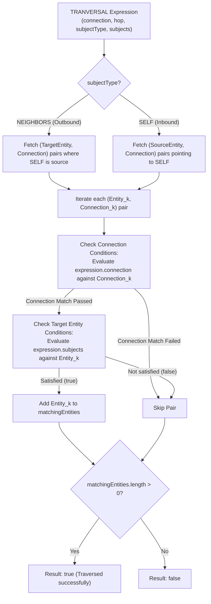

# SILIC Query Engine & Language Architecture

This document details the architecture, component modules, AST specifications, and execution workflow for queries within the SILIC Knowledge Graph system following updates to the **SILIC Query Language (WHERE-clause SQL-like DSL)**, unified **`RecordSelector` model**, **`TemplateSelector` & `TEMPLATE` operands**, **`TRANVERSAL` with connection conditions & hop counts**, and the **interactive SILIC code editor**.

---

## 1. Modules & Architecture

The system is designed with a 3-tier decoupled architecture:

```text
┌────────────────────────────────────────────────────────┐
│                      Language Layer                    │
│     SILIC Query DSL Text  ──►  SilicLexer / Parser     │
└───────────────────────────┬────────────────────────────┘
                            │ (EntityQuery AST)
┌───────────────────────────▼────────────────────────────┐
│                    Execution Layer                     │
│  ├── QueryExecutionRouter                              │
│  ├── EntityQueryExecutor / PathQueryExecutor           │
│  ├── ExpressionEvaluator & OperandResolver             │
│  ├── EntitySelectorResolver                            │
│  ├── GraphTraversalEngine                              │
│  └── OperatorEngine & AggregateEngine                  │
└───────────────────────────┬────────────────────────────┘
                            │
┌───────────────────────────▼────────────────────────────┐
│                     Storage Layer                      │
│        (Entity / Record / Connection / Template)       │
└────────────────────────────────────────────────────────┘
```

### Module Responsibilities:

| Module | Source File | Core Responsibility |
| :--- | :--- | :--- |
| **`SilicLexer`** | `src/lib/query/parser/SilicLexer.ts` | Tokenizes SILIC query strings into streams of identifiers, literals, arrows, and operator tokens. |
| **`SilicParser`** | `src/lib/query/parser/SilicParser.ts` | Recursive descent parser that converts SILIC query strings into structured AST `EntityQuery` objects. |
| **`QueryExecutionRouter`** | `src/lib/query/executor/QueryExecutionRouter.ts` | Central dispatch entry point routing queries to `EntityQueryExecutor` or `PathQueryExecutor`. |
| **`EntityQueryExecutor`** | `src/lib/query/executor/EntityQueryExecutor.ts` | Coordinates the Entity Query execution pipeline: Candidate generation → AST evaluation → Matching `Entity[]`. |
| **`PathQueryExecutor`** | `src/lib/query/executor/PathQueryExecutor.ts` | Finds shortest path between entities via Breadth-First Search (BFS) graph traversal. |
| **`InMemoryEntityRepository`** | `src/lib/query/repository/EntityRepository.ts` | Manages entity, template, and connection indexes with fast lookups. |
| **`GraphTraversalEngine`** | `src/lib/query/traversal/GraphTraversalEngine.ts` | Executes multi-entity outbound and inbound graph traversals with directionality and hop limits. |
| **`EntitySelectorResolver`** | `src/lib/query/selector/EntitySelectorResolver.ts` | Resolves `RecordSelector` against current entity data and template names. |
| **`OperandResolver`** | `src/lib/query/expression/OperandResolver.ts` | Resolves `LITERAL`, `ARRAY`, `RECORDSELECTOR`, `TEMPLATESELECTOR`, and `TEMPLATE`, plus date extraction functions. |
| **`ExpressionEvaluator`** | `src/lib/query/expression/ExpressionEvaluator.ts` | Evaluates AST expression trees (`NOT`, `NEUTRAL`, `MULTI`, `TRANVERSAL`) with connection condition matching and operator precedence. |
| **`OperatorEngine`** | `src/lib/query/operator/OperatorEngine.ts` | Executes binary operators (`=`, `!=`, `>`, `<`, `>=`, `<=`, `~`, `IN`, `+`, `-`, `*`, `/`, `AND`, `OR`). |
| **`AggregateEngine`** | `src/lib/query/aggregate/AggregateEngine.ts` | Statistical aggregation functions (`SUM`, `COUNT`, `MEAN`, `MEDIAN`, `MIN`, `MAX`). |
| **`EntityQuerySheet`** | `src/components/main/queryBlocks/EntityQuerySheet.tsx` | Full-featured monospace SILIC query editor with 4-space Tab indentation and instant execution. |

---

## 2. SILIC Query Language Specification

The SILIC query language is a declarative WHERE-clause DSL designed specifically for knowledge graphs.

### 2.1. Values & Literals

| Value Type | Syntax / Example | Description |
| :--- | :--- | :--- |
| **NOT / Negation** | `!expr` or `NOT expr` | Logical NOT inversion. |
| **Number** | `1`, `42`, `3.14`, `-10` | Floating-point or integer decimal values. |
| **String** | `"Hoa"`, `"friend"`, `'admin'` | Quoted character strings with escape support. |
| **Boolean** | `TRUE`, `FALSE` | Case-insensitive boolean literals. |
| **Date Functions** | `YEAR(x)`, `MONTH(x)`, `DAY(x)`, `HOUR(x)`, `MINUTE(x)`, `SECOND(x)` | Extracts date components from Date objects or ISO date strings. |
| **Array** | `[1, 2, 3]`, `["A", "B"]` | Comma-delimited list of items inside square brackets. |

### 2.2. Record Selectors (`RecordSelector`)

In SILIC, **record names MUST begin with a leading dot `.`**, and can optionally be wrapped in quotes `"` if they contain spaces or special characters:

- `.recordName` or `."record name"`: Matches record `recordName` across all templates (wildcard `*`).
- `*.recordName` or `*."record name"`: Explicit wildcard selector across all templates.
- `templateName.recordName` or `"templateName"."recordName"`: Only matches record `recordName` belonging to template `templateName`.
- `["template 1", "template 2"]."record name"`: Matches record `record name` from any of the specified templates.

> **💡 Note on Literals vs Selectors:**
> A string without a leading/trailing dot like `"a"` is always treated as a **pure string literal**. Therefore, `"a" = "a"` evaluates to `TRUE` (matching all entities), whereas `."a" = "a"` evaluates the entity's record `"a"` against the literal string `"a"`.

### 2.3. Template Matching (`TEMPLATESELECTOR` & `TEMPLATE`)

**Template names MUST have a trailing dot `.`** to represent the template itself:

- `templateName.` or `"templateName".` : Checks if the entity was instantiated from `templateName`.
- `TEMPLATE = "templateName"` : Directly compares the template name string.

### 2.4. Graph Traversal (`TRANVERSAL`)

Traversal expressions check relationships and properties of connected entities in the graph:

- **Inbound Traversal**:
  - `SELF <-- (...)` : Finds entities that connect to or point to `SELF` satisfying the target condition.
  - `SELF <--n-- (...)` : Traverses exactly `n` hops inbound.
- **Outbound Traversal**:
  - `NEIGHBORS <-- (...)` : Finds entities that `SELF` points to (outbound) satisfying the target condition.
- **Connection Condition Constraints**:
  - `SELF (."role" = "friend") <-- (...)` : Checks attribute conditions on the connection before evaluating target entity.
  - `SELF ("templateName"."recordName" = ...) <-- (...)` : Checks attribute conditions on the connection with template specified.
  - `SELF (["tpl1", "tpl2"]."record" = ...) <-- (...)` : Validates multi-template connection records.
  - `SELF <--["template1", "template2"]."record"-- (...)` : Arrow-embedded connection filter.
  - `SELF (...) <--n-- (...)` : Connection condition combined with explicit hop count.

### 2.5. Logical Grouping (`MULTI`)

Parentheses `(...)` are used to define explicit evaluation precedence:
- `(."tên" = "Hoa") AND (."tuổi tác" > 10)`
- `(SELF <-- ."tên" = "Hoa") AND (NEIGHBORS <-- ."tuổi tác" > 10)`

### 2.6. Operator Evaluation Semantics & Operand Combinations

Below is the exhaustive specification of how each operator and operator group behaves across all 6 combinations of operands:
1. **Literal - Literal** (Scalar - Scalar)
2. **Literal - List** (Scalar - Array)
3. **List - Literal** (Array - Scalar)
4. **List - List (Equal Length)**: $\text{len}(A) = \text{len}(B)$
5. **List - List (First Shorter)**: $\text{len}(A) < \text{len}(B)$
6. **List - List (Second Shorter)**: $\text{len}(A) > \text{len}(B)$

---

#### 1. Equality & Inequality Operators (`=`, `!=`)

| Operand Combination | Behavior & Evaluation Rule | Example | Result |
| :--- | :--- | :--- | :--- |
| **Literal - Literal** | Direct scalar equality comparison (supports Number, String, Date, Boolean). | `5 = 5`<br/>`"a" = "b"` | `TRUE`<br/>`FALSE` |
| **Literal - List** | Returns `TRUE` if **at least one element** in the List equals the Literal (`some(literal == item)`). | `2 = [1, 2, 3]`<br/>`4 = [1, 2, 3]` | `TRUE`<br/>`FALSE` |
| **List - Literal** | Returns `TRUE` if **at least one element** in the List equals the Literal (`some(item == literal)`). | `["a", "b"] = "a"`<br/>`["a", "b"] = "c"` | `TRUE`<br/>`FALSE` |
| **List - List (Equal Length)** | Exact element-by-element equality check in order (`isEqual(A, B)`). Both lists must have identical elements at corresponding indices. | `[1, 2] = [1, 2]`<br/>`[1, 2] = [2, 1]` | `TRUE`<br/>`FALSE` |
| **List - List (First Shorter)** | Arrays of different lengths are not equal; always evaluates to `FALSE`. | `[1] = [1, 2]` | `FALSE` |
| **List - List (Second Shorter)** | Arrays of different lengths are not equal; always evaluates to `FALSE`. | `[1, 2] = [1]` | `FALSE` |

> *Note on `!=`:* Inverts the result of `=` for all combinations.

---

#### 2. Relational / Ordering Operators (`>`, `<`, `>=`, `<=`)

| Operand Combination | Behavior & Evaluation Rule | Example | Result |
| :--- | :--- | :--- | :--- |
| **Literal - Literal** | Standard scalar ordering (Number magnitude, Date timestamp, String lexicographical). | `15 > 10`<br/>`"b" > "a"` | `TRUE`<br/>`TRUE` |
| **Literal - List** | Returns `TRUE` if `Literal [OP] item` holds for **at least one item** in the List. | `3 < [1, 5, 8]`<br/>`10 < [1, 5, 8]` | `TRUE` *(3 < 5)*<br/>`FALSE` |
| **List - Literal** | Returns `TRUE` if `item [OP] Literal` holds for **at least one item** in the List. | `[1, 5, 8] > 4`<br/>`[1, 2, 3] > 5` | `TRUE` *(5, 8 > 4)*<br/>`FALSE` |
| **List - List (Equal Length)** | Scalar array comparison semantics. | `[2, 3] > [1, 2]` | `TRUE` |
| **List - List (First Shorter)** | Scalar array comparison semantics. | `[1] < [1, 2]` | `TRUE` |
| **List - List (Second Shorter)** | Scalar array comparison semantics. | `[1, 2] > [1]` | `TRUE` |

---

#### 3. Fuzzy Substring Match Operator (`~`)

| Operand Combination | Behavior & Evaluation Rule | Example | Result |
| :--- | :--- | :--- | :--- |
| **Literal - Literal** | Case-insensitive substring match: checks if Left string contains Right string. | `"Hello World" ~ "world"`<br/>`"Silic Graph" ~ "tree"` | `TRUE`<br/>`FALSE` |
| **Literal - List** | Returns `TRUE` if the Left string contains **any** substring from the Right List. | `"Database System" ~ ["base", "app"]` | `TRUE` |
| **List - Literal** | Returns `TRUE` if **at least one item** in the Left List contains the Right substring. | `["Alice", "Bob"] ~ "lic"` | `TRUE` |
| **List - List (Any Length)** | Checks if any item in the Left List matches any substring in the Right List. | `["User A", "Admin"] ~ ["admin", "root"]` | `TRUE` |

---

#### 4. Set Membership Operator (`IN`)

| Operand Combination | Behavior & Evaluation Rule | Example | Result |
| :--- | :--- | :--- | :--- |
| **Literal - Literal** | Equivalent to scalar equality comparison `A = B`. | `"Hoa" IN "Hoa"` | `TRUE` |
| **Literal - List** | Checks if the Literal is an element of the List (`List.includes(Literal)`). | `"Hoa" IN ["Hoa", "Lan"]`<br/>`"Mai" IN ["Hoa", "Lan"]` | `TRUE`<br/>`FALSE` |
| **List - Literal** | Checks if the List contains an item equal to the Literal. | `["Hoa", "Lan"] IN "Hoa"` | `TRUE` |
| **List - List (Equal Length)** | **Subset verification**: checks if every element in List A exists in List B (`A.every(itemA => B.includes(itemA))`). | `[1, 2] IN [2, 1]`<br/>`[1, 2] IN [2, 3]` | `TRUE`<br/>`FALSE` |
| **List - List (First Shorter)** | **Subset verification**: returns `TRUE` if all elements of the shorter List A are present in List B. | `[1, 2] IN [1, 2, 3]`<br/>`[1, 4] IN [1, 2, 3]` | `TRUE`<br/>`FALSE` |
| **List - List (Second Shorter)** | **Subset verification**: returns `FALSE` if List A contains elements not found in the shorter List B. | `[1, 2, 3] IN [1, 2]` | `FALSE` |

---

#### 5. Arithmetic Operators (`+`, `-`, `*`, `/`)

Arithmetic operations produce a numeric result (or an array of numeric results). When evaluated in a boolean WHERE filter context, `0` or `NaN` evaluates to `FALSE`, while any non-zero number evaluates to `TRUE`.

| Operand Combination | Behavior & Evaluation Rule | Example | Output |
| :--- | :--- | :--- | :--- |
| **Literal - Literal** | Standard scalar arithmetic calculation. | `10 + 5`<br/>`20 * 2` | `15`<br/>`40` |
| **Literal - List** | Literal is treated as single-element array `[Literal]`. Calculated element-wise for $N = \min(1, \text{len}(B)) = 1$. Returns single-element array. | `10 + [1, 2, 3]` | `[11]` |
| **List - Literal** | Literal is treated as single-element array `[Literal]`. Calculated element-wise for $N = \min(\text{len}(A), 1) = 1$. Returns single-element array. | `[10, 20, 30] + 5` | `[15]` |
| **List - List (Equal Length)** | Element-wise arithmetic applied to all $N = \text{len}(A)$ corresponding pairs: `[A[i] OP B[i]]`. | `[10, 20] + [1, 2]`<br/>`[10, 20] * [2, 3]` | `[11, 22]`<br/>`[20, 60]` |
| **List - List (First Shorter)** | Element-wise arithmetic calculated up to $N = \min(\text{len}(A), \text{len}(B)) = \text{len}(A)$ items. | `[10, 20] + [1, 2, 3, 4]` | `[11, 22]` |
| **List - List (Second Shorter)** | Element-wise arithmetic calculated up to $N = \min(\text{len}(A), \text{len}(B)) = \text{len}(B)$ items. | `[10, 20, 30, 40] + [1, 2]` | `[11, 22]` |

---

#### 6. Logical Operators (`AND`, `OR`, `NOT`)

| Operator | Left Operand | Right Operand | Evaluation Semantics |
| :--- | :--- | :--- | :--- |
| **`AND`** | `Truthy` | `Truthy` | Returns `TRUE` only if both operands evaluate to truthy values. |
| **`AND`** | Any `Falsy` | Any | Returns `FALSE` (short-circuiting logic). |
| **`OR`** | Any `Truthy` | Any | Returns `TRUE` if at least one operand evaluates to a truthy value. |
| **`OR`** | `Falsy` | `Falsy` | Returns `FALSE`. |
| **`NOT` (`!`)** | N/A | `Truthy` / `Falsy` | Inverts the boolean truth value of the subject operand. |

---

## 3. Query AST Type Definitions (`query-types.ts`)

```ts
export type AggreeateFunction =
  | "MEAN"
  | "MEDIAN"
  | "MIN"
  | "MAX"
  | "SUM"
  | "COUNT"

export type DateFunction =
  | "MONTH"
  | "DAY"
  | "YEAR"
  | "HOUR"
  | "MINUTE"
  | "SECOND"

export type Operator =
  | "="
  | "!="
  | ">"
  | "<"
  | ">="
  | "<="
  | "~"
  | "IN"
  | "+"
  | "-"
  | "*"
  | "/"
  | "AND"
  | "OR"

export type RecordSelector = {
  template?: string[] | "*" // Template IDs/names or "*"
  record: string // Record field name
}

export type TemplateSelector = {
  template: string // Template name or ID
}

export type PrimaryOperand = {
  value:
    | {
        type: "LITERAL"
        value: number | string | boolean | Date
        dateFunction?: DateFunction
      }
    | {
        type: "ARRAY"
        value: number[] | string[] | boolean[] | Date[]
        function?: AggreeateFunction
      }
    | {
        type: "RECORDSELECTOR" | "ENTITYSELECTOR" | "CONNECTIONSELECTOR"
        value: RecordSelector
        function?: AggreeateFunction
        dateFunction?: DateFunction
      }
    | {
        type: "TEMPLATESELECTOR"
        value: TemplateSelector
      }
    | {
        type: "TEMPLATE"
        value?: string
      }
}

export type Expression =
  | {
      type: "NOT" | "NEUTRAL"
      subject: Expression | PrimaryOperand
    }
  | {
      type: "MULTI"
      operators: Operator[]
      subjects: (Expression | PrimaryOperand)[]
    }
  | {
      type: "TRANVERSAL"
      operators: Operator[]
      hop?: number
      subjectType: "SELF" | "NEIGHBORS"
      connection?: (Expression | PrimaryOperand)[] // Connection record condition
      subjects: (Expression | PrimaryOperand)[] // Target entity condition
    }

export type PathConstraintQuantifier =
  | "AT_LEAST_ONE" // Default implicit quantifier (>= 1 occurrence)
  | "AVOID" // 0 TIMES (No occurrences permitted)
  | "ALL_TIMES" // ONLY (All items must match, overriding others)
  | { times: number } // n TIMES (Exact occurrence count)

export type PathItemType = "CONNECTION" | "ENTITY" | "ANY"

export type PathExpression =
  | {
      type: "PATH_SEQUENCE" // A << B (A appears before B in path)
      left: PathExpression
      right: PathExpression
    }
  | {
      type: "PATH_OR" // A || B (At least one of A or B in path)
      left: PathExpression
      right: PathExpression
    }
  | {
      type: "PATH_AND" // A AND B (Both conditions in path)
      left: PathExpression
      right: PathExpression
    }
  | {
      type: "PATH_ARROW" // (connectionExpr) <-- (entityExpr)
      connectionExpr?: PathExpression
      entityExpr?: PathExpression
    }
  | {
      type: "PATH_CONSTRAINT"
      quantifier?: PathConstraintQuantifier
      targetType?: PathItemType
      expression: Expression | PrimaryOperand
    }

export type EntityQuery = {
  where: Expression
}

export type PathQuery = {
  from: string
  to: string
  code?: string
  where?: PathExpression
  via?: RecordSelector[]
}
```

---

## 4. `TRANVERSAL` Evaluation Workflow



---

## 5. Examples & Query Demonstrations

### Example 1: Basic Entity Attribute Filter
**SILIC Query**:
```sql
(."tên" = "Hoa") AND (."tuổi tác" > 10)
```
**AST Generated**:
```json
{
  "type": "MULTI",
  "operators": ["AND"],
  "subjects": [
    {
      "type": "MULTI",
      "operators": ["="],
      "subjects": [
        { "value": { "type": "RECORDSELECTOR", "value": { "template": "*", "record": "tên" } } },
        { "value": { "type": "LITERAL", "value": "Hoa" } }
      ]
    },
    {
      "type": "MULTI",
      "operators": [">"],
      "subjects": [
        { "value": { "type": "RECORDSELECTOR", "value": { "template": "*", "record": "tuổi tác" } } },
        { "value": { "type": "LITERAL", "value": 10 } }
      ]
    }
  ]
}
```

### Example 2: Relationship Traversal with Connection Condition
**SILIC Query**:
```sql
(SELF (."role" = "friend") <-- ."tên" = "Hoa") AND (NEIGHBORS <-- ."tuổi tác" > 10)
```
**Interpretation**:
Matches entities that have an inbound `"friend"` relationship from a character named `"Hoa"`, and simultaneously point to a neighbor entity whose `"tuổi tác"` is greater than 10.

---

## 6. SILIC Path Query Language Specification

The **SILIC Path Query Language** is a declarative DSL to search for the shortest path between two entities satisfying relational constraints, entity properties, sequence order, alternatives, and quantifiers.

### 6.1. High-Level Syntax
```sql
(connectionConditions) <-- (entityConditions)
```
- **Left of `<--`**: Conditions applied to the **relationships / connections** along the path.
- **Right of `<--`**: Conditions applied to the **entities / nodes** along the path.

### 6.2. Operators & Quantifiers

| Operator / Quantifier | Syntax | Description |
| :--- | :--- | :--- |
| **Sequence (`<<`)** | `A << B` | Item $A$ must appear **strictly before** item $B$ in the path sequence ($\text{pos}(A) < \text{pos}(B)$). |
| **Alternative (`\|\|`)** | `A \|\| B` | Unordered choice: path must contain **at least one** item matching $A$ or $B$. |
| **Logical AND** | `A AND B` | Both condition $A$ and condition $B$ must hold along the path. |
| **AVOID (Zero Times)** | `AVOID A`<br/>`0 TIMES A` | Path must **NOT contain any item** matching $A$. |
| **Exact Count** | `n TIMES A` | Path must contain **exactly $n$ occurrences** of $A$ (e.g. `2 TIMES A`). |
| **Exclusivity** | `ALL TIMES A`<br/>`ONLY A` | **Every item** of that type along the path must match $A$. |

> **💡 Scope Rule:**
> If $A$ is a relationship condition (e.g., `TEMPLATE = "Bạn bè"`), `ALL TIMES A` ensures that 100% of the connections on the path are `"Bạn bè"`.

### 6.3. Path Query Examples

#### Example 1: Relationship & Entity Filtering with Avoidance
Find a path that passes through at least one entity with age > 10, passes through at least one `"Bạn bè"` relationship, and contains no `"Người thân"` relationships:
```sql
((TEMPLATE = "Bạn bè") AND (AVOID TEMPLATE = "Người thân")) <-- (*.Tuổi > 10)
```

#### Example 2: Sequential Workflow Progression
Find a path where a `"Trường học"` connection appears before a `"Công ty"` connection:
```sql
(TEMPLATE = "Trường học") << (TEMPLATE = "Công ty")
```

#### Example 3: Uniform Connection Type
Find a path made exclusively of `"Đồng nghiệp"` connections:
```sql
ALL TIMES (TEMPLATE = "Đồng nghiệp")
```

### 6.4. Unconstrained / Default Queries
In both Entity Queries and Path Queries, empty inputs or empty parenthetical groups evaluate directly to `true` (unconstrained match):

| Input | Entity Query Evaluation | Path Query Evaluation |
| :--- | :--- | :--- |
| `""` *(empty / whitespace)* | `true` (matches all entities) | `true` (standard unconstrained shortest path) |
| `()` | `true` (matches all entities) | `true` (standard unconstrained shortest path) |
| `<--` | — | `true` (unconstrained connections and entities) |
| `() <-- ()` | — | `true` (unconstrained connections and entities) |
| `() <-- (entityCondition)` | — | Evaluates `entityCondition` on path entities, unconstrained on connections |
| `(connCondition) <-- ()` | — | Evaluates `connCondition` on path connections, unconstrained on entities |


