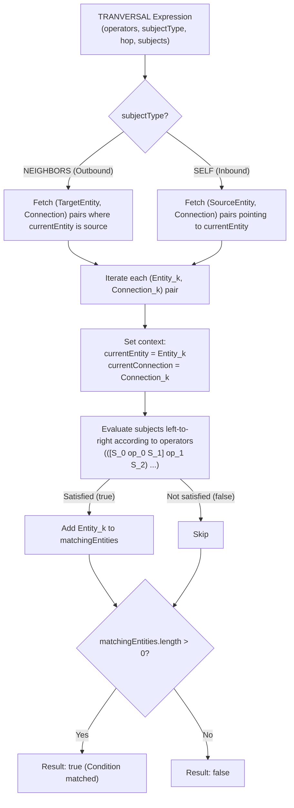

# Knowledge Graph Query Engine Architecture & Execution Flow

This document details the architecture, component modules, and execution workflow for queries (**Entity Query** and **Path Query**) within the project's Knowledge Graph system following updates to the **Multi-entity Connections** model, **`CONNECTIONSELECTOR` in Operands**, and **Multi-point Operator Chaining (`operators?: Operator[]`) in `MULTI` & `TRANVERSAL` Expressions with left-to-right sequential evaluation**.

---

## 1. Modules & Architecture

The system is designed with a 3-tier decoupled architecture:

```text
┌────────────────────────────────────────────────────────┐
│                      Query Layer                       │
│              (EntityQuery / PathQuery)                 │
└───────────────────────────┬────────────────────────────┘
                            │
┌───────────────────────────▼────────────────────────────┐
│                    Execution Layer                     │
│  ├── QueryExecutionRouter                              │
│  ├── EntityQueryExecutor / PathQueryExecutor           │
│  ├── ExpressionEvaluator & OperandResolver             │
│  ├── EntitySelectorResolver                            │
│  ├── GraphTraversalEngine                              │
│  └── OperatorEngine & AggregateEngine                  │
└───────────────────────────┬────────────────────────────┘
                            │
┌───────────────────────────▼────────────────────────────┐
│                     Storage Layer                      │
│        (Entity / Record / Connection / Template)       │
└────────────────────────────────────────────────────────┘
```

### Module Responsibilities:

| Module | Source File | Core Responsibility |
| :--- | :--- | :--- |
| **`QueryExecutionRouter`** | `src/lib/query/executor/QueryExecutionRouter.ts` | Central dispatch entry point, routing incoming queries to the appropriate executor (`EntityQueryExecutor` or `PathQueryExecutor`). |
| **`EntityQueryExecutor`** | `src/lib/query/executor/EntityQueryExecutor.ts` | Coordinates the entire Entity Query execution pipeline: Fetch candidates → Evaluate WHERE clause → Return matching `Entity[]` list. |
| **`PathQueryExecutor`** | `src/lib/query/executor/PathQueryExecutor.ts` | Coordinates the pipeline for finding the shortest path between two entities via Breadth-First Search (BFS). |
| **`InMemoryEntityRepository`** | `src/lib/query/repository/EntityRepository.ts` | Manages entity/record and connection data access with `O(1)` index lookups. |
| **`GraphTraversalEngine`** | `src/lib/query/traversal/GraphTraversalEngine.ts` | Performs graph traversals across multi-entity relationships (`from: string[]` → `to: string[]`), outbound and inbound directions, directional/undirected relations (`isDirectional`), and the BFS shortest-path algorithm. |
| **`EntitySelectorResolver`** | `src/lib/query/selector/EntitySelectorResolver.ts` | Extracts record values from the current entity context (`context.currentEntity`). |
| **`OperandResolver`** | `src/lib/query/expression/OperandResolver.ts` | Resolves 4 types of `PrimaryOperand`: `LITERAL`, `ARRAY`, `ENTITYSELECTOR`, and `CONNECTIONSELECTOR` (extracts record values from `context.currentConnection`). |
| **`ExpressionEvaluator`** | `src/lib/query/expression/ExpressionEvaluator.ts` | Evaluates AST expression trees sequentially using **left-to-right associativity**, supporting `NOT`, `NEUTRAL`, `MULTI`, and `TRANVERSAL` with an array of `operators: Operator[]` connecting `subjects`. |
| **`OperatorEngine`** | `src/lib/query/operator/OperatorEngine.ts` | Provides `applyBinary(operator, a, b)` to execute comparison operations (`=`, `!=`, `>`, `<`, `>=`, `<=`, `~`, `IN`), element-wise arithmetic (`+`, `-`, `*`, `/`), and boolean logic (`AND`, `OR`). |
| **`AggregateEngine`** | `src/lib/query/aggregate/AggregateEngine.ts` | Provides pure statistical aggregation functions (`SUM`, `COUNT`, `MEAN`, `MEDIAN`, `MIN`, `MAX`) without mutating the source array. |
| **`OperatorSelect`** | `src/components/main/queryBlocks/components/OperatorSelect.tsx` | Standalone UI component displaying and allowing operator selection between blocks, supporting badge/pill variants and localization. |
| **`ConnectionContext`** | `src/contexts/ConnectionContext.tsx` | React Context managing the `connections: Connection[]` state, CRUD functions (`put`, `delete`), and connection display name helpers. |
| **`EntityContext`** | `src/contexts/entityContext.tsx` | React Context providing the `entities` state, CRUD functions (`put`, `delete`), and query execution methods (`executeEntityQuery`, `executePathQuery`). |

---

## 2. Connection Data Model & Operator Types

### Independent Connection Structure:
```ts
export type Connection = {
  id: string
  from: string[] // List of source entity IDs
  to: string[] // List of target entity IDs
  isDirectional: boolean // true = directed (from -> to), false = undirected (from <-> to)
  template?: string // Template ID applied to the Connection
  records: Record[] // Relationship attributes / metadata
}
```

### Operator Type (`Operator`):
```ts
export type Operator =
  | "="
  | "!="
  | ">"
  | "<"
  | ">="
  | "<="
  | "~"
  | "IN"
  | "+"
  | "-"
  | "*"
  | "/"
  | "AND"
  | "OR"
```

---

## 3. Entity Query AST & Operator Chaining (`operators: Operator[]`)

### AST Expressions & Operands Structure:
```ts
export type AggreeateFunction =
  "MEAN" | "MEDIAN" | "MIN" | "MAX" | "SUM" | "COUNT"

export type PrimaryOperand = {
  value:
    | {
        type: "LITERAL"
        value: number | string | boolean | Date
      }
    | {
        type: "ARRAY"
        value: number[] | string[] | boolean[] | Date[]
        function?: AggreeateFunction
      }
    | {
        type: "ENTITYSELECTOR"
        value: EntitySelector
        function?: AggreeateFunction
      }
    | {
        type: "CONNECTIONSELECTOR"
        value: ConnectionSelector
        function?: AggreeateFunction
      }
}

export type Expression =
  | {
      type: "NOT" | "NEUTRAL"
      subject: Expression | PrimaryOperand
    }
  | {
      type: "MULTI"
      operators: Operator[]
      subjects: (Expression | PrimaryOperand)[]
    }
  | {
      type: "TRANVERSAL"
      operators: Operator[]
      hop?: number // Number of intermediary hops, including both start and end entities
      subjectType: "SELF" | "NEIGHBORS"
      subjects: (Expression | PrimaryOperand)[]
    }

export type EntitySelector = {
  template?: string[] // Template IDs
  record: string // Record field name
}

export type ConnectionSelector = {
  template?: string[] // Template IDs
  record: string // Record field name
}

export type EntityQuery = {
  where: Expression
}
```

---

## 4. Evaluation Mechanism & Automatic Multiplication/Division Grouping (`*`, `/`)

In the **N-ary Expression** model, sub-blocks in `subjects` are interleaved with explicit individual operators:
`[Block 0] [Operator 0] [Block 1] [Operator 1] [Block 2] ... [Operator N-2] [Block N-1]`

### 4.1. Automatic Pre-Grouping of Multiplicative Operators (`*`, `/`):
To preserve standard mathematical operator precedence ("multiplication and division before addition and subtraction") even within a flat expression without user-created sub-blocks:
- Prior to evaluation, `ExpressionEvaluator` scans the `operators` array.
- When it detects a mix of multiplicative operators (`*`, `/`) and lower-precedence operators (`+`, `-`, `=`, `>`, `AND`, etc.), the system **automatically groups consecutive `*` and `/` operations into nested `MULTI` sub-blocks**.
- Examples:
  ```text
  Flat: [A] [+] [B] [*] [C]  ==>  [A] [+] [MULTI: B * C]
  Flat: [20] [-] [6] [/] [2] [+] [3] [*] [4]  ==>  [20] [-] [MULTI: 6 / 2] [+] [MULTI: 3 * 4]
  ```

### 4.2. Sequential Left-to-Right Evaluation:
Once multiplicative operations have been prioritized into groups (or for expressions with uniform precedence such as pure `+`/`-` or logic `AND`/`OR`), the expression is evaluated strictly from left to right (**Left-associative**):
```text
Result = (...(([S_0 op_0 S_1] op_1 S_2) op_2 S_3) ... op_{N-2} S_{N-1})
```

```ts
// Core algorithm in ExpressionEvaluator
const rawSubjects = expression.subjects || []
if (rawSubjects.length === 0) return undefined
if (rawSubjects.length === 1) {
  return this.evaluate(rawSubjects[0], context)
}

const rawOperators = expression.operators || []

// 1. Automatic pre-processing to group multiplication/division (*, /)
const { subjects, operators } = this.groupMultiplicativeOperations(
  rawSubjects,
  rawOperators
)

// 2. Sequential evaluation from left to right
let acc = this.evaluate(subjects[0], context)
for (let i = 0; i < subjects.length - 1; i++) {
  const op = operators[i] || "AND"
  const nextVal = this.evaluate(subjects[i + 1], context)
  acc = OperatorEngine.applyBinary(op, acc, nextVal)
}
return acc
```

### Calculation Flow Examples:
1. **Flat arithmetic with automatic precedence**: `[10] [+] [5] [*] [2]`
   - Pre-processing: Automatically groups `[5] [*] [2]` into the sub-block `MULTI: [5 * 2] = 10`.
   - Evaluation: `10 + 10 = 20`.
2. **Compound logic**: `[age > 20] [AND] [username = 'Alice'] [OR] [age = 17]`
   - Step 1: `(age > 20) AND (username = 'Alice')` → `Boolean R1`.
   - Step 2: `R1 OR (age = 17)` → `Final Result`.

---

## 5. Sub-Block Grouping Conventions (Operator Precedence & Parentheses Grouping)

To explicitly control or override default precedence rules (analogous to parentheses `( ... )` in math and logic), the system uses **nested sub-blocks** (nesting a child `MULTI` block within the `subjects` array).

When `ExpressionEvaluator` encounters an `Expression` subject, it recursively evaluates the entire sub-block to resolve its scalar value before proceeding with the parent block's operator chain.

### Sub-Block Grouping Illustration:

```text
Flat Logic:                  [ A ]  [ OR ]  [ B ]  [ AND ]  [ C ]   ==>  ((A OR B) AND C)
Sub-Block Grouped Logic:     [ A ]  [ OR ]  [ MULTI: (B AND C) ]   ==>  (A OR (B AND C))

Parentheses Override:        [ MULTI: (10 + 5) ]  [*]  [ 2 ]       ==>  (10 + 5) * 2 = 30
```

### Concrete Examples:

#### 1. Logical Expression: `username = 'Bob' OR (username = 'Alice' AND age = 25)`
Corresponding AST structure:
```ts
{
  type: "MULTI",
  operators: ["OR"],
  subjects: [
    {
      type: "MULTI",
      operators: ["="],
      subjects: [
        { value: { type: "ENTITYSELECTOR", value: { record: "username" } } },
        { value: { type: "LITERAL", value: "Bob" } }
      ]
    },
    {
      type: "MULTI", // Sub-block acts as parentheses: (username = 'Alice' AND age = 25)
      operators: ["AND"],
      subjects: [
        {
          type: "MULTI",
          operators: ["="],
          subjects: [
            { value: { type: "ENTITYSELECTOR", value: { record: "username" } } },
            { value: { type: "LITERAL", value: "Alice" } }
          ]
        },
        {
          type: "MULTI",
          operators: ["="],
          subjects: [
            { value: { type: "ENTITYSELECTOR", value: { record: "age" } } },
            { value: { type: "LITERAL", value: 25 } }
          ]
        }
      ]
    }
  ]
}
```

#### 2. Arithmetic Precedence Override: `(10 + 5) * 2 = 30`
- **Default flat**: `[10] [+] [5] [*] [2]` → automatically grouped into `10 + (5 × 2) = 20`.
- **Sub-block override**: `[MULTI: 10 + 5] [*] [2]` → `(10 + 5) × 2 = 30`.

---

## 6. `TRANVERSAL` Expression Evaluation Mechanism

In this model, `ConnectionSelector` is standardized as a `PrimaryOperand` placed directly within `subjects`. Consequently, `TRANVERSAL` does not require a separate dedicated `connection` attribute:

1. **Identify Linked `(TargetEntity, Connection)` Pairs**:
   - **`subjectType === "NEIGHBORS"` (Outbound)**: Finds all entities `T` that `currentEntity` points to via connection `C`.
   - **`subjectType === "SELF"` (Inbound)**: Finds all entities `S` pointing to `currentEntity` via connection `C`.

2. **Establish Evaluation Context for Each `(TargetEntity, Connection)` Pair**:
   For each pair, `ExpressionEvaluator` constructs an evaluation context:
   ```ts
   const evalContext: QueryContext = {
     ...context,
     currentEntity: targetEntity,       // Used for ENTITYSELECTOR
     currentConnection: pair.connection // Used for CONNECTIONSELECTOR
   }
   ```

3. **Evaluate `subjects` Against the `operators` Chain**:
   - `subjects` can contain both **Connection** conditions (via `CONNECTIONSELECTOR`, e.g., `role = "friend"`) and **Neighbor Entity** conditions (via `ENTITYSELECTOR`, e.g., `age >= 18` or `username = "Bob"`).
   - `TRANVERSAL` evaluates the sequence `[Subject 0] [Op 0] [Subject 1] ...` for each connection pair.
   - All entities satisfying these criteria are collected into the `matchingEntities: Entity[]` list.
   - Within the WHERE clause, if `matchingEntities.length > 0`, the evaluated entity resolves to `true`.

### `TRANVERSAL` Evaluation Flow Diagram:



---

## 7. Path Query Execution

Path Query executes a **Shortest Path** search between two entities on the unweighted graph, supporting relationship constraints via `via: ConnectionSelector[]` and edge directionality (`isDirectional`).

```ts
export type PathQuery = {
  from: string // Starting Entity ID
  to: string // Target Entity ID
  via?: ConnectionSelector[] // Permitted ConnectionSelectors allowed along the path
}

export interface PathQueryResult {
  found: boolean
  entities: Entity[] // List of Entity objects along the path
  connections: Connection[] // List of Connection objects traversed
}
```
