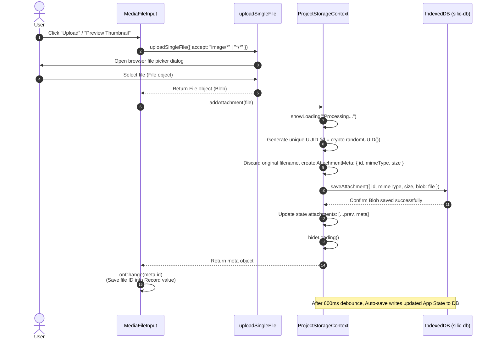
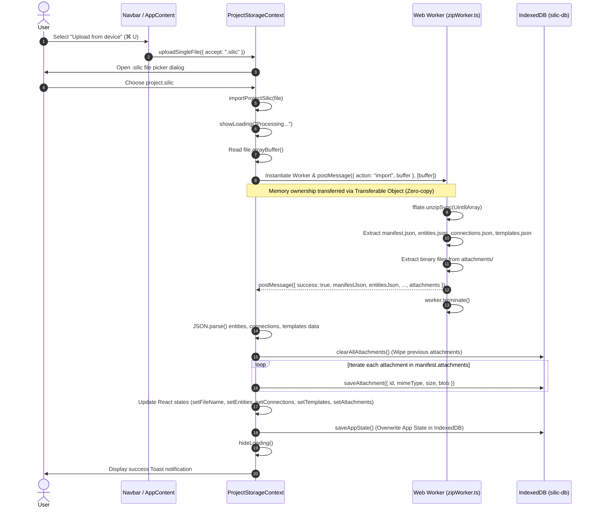
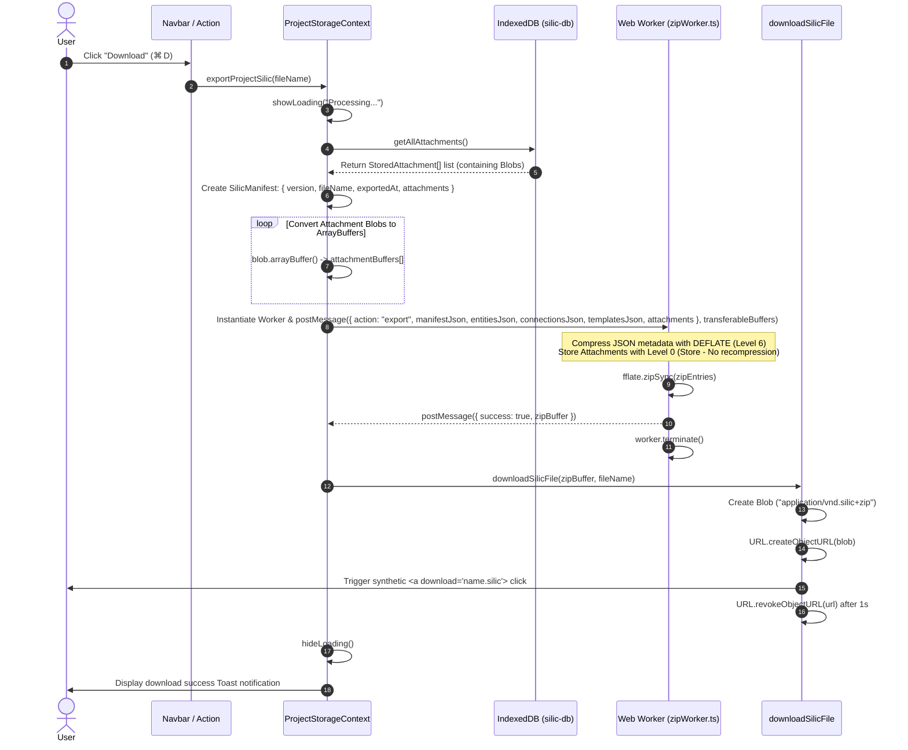
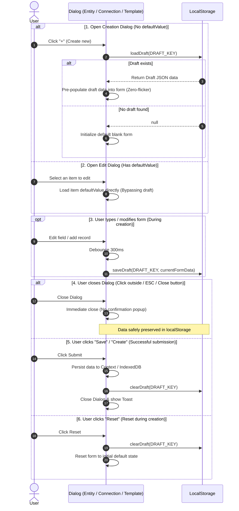
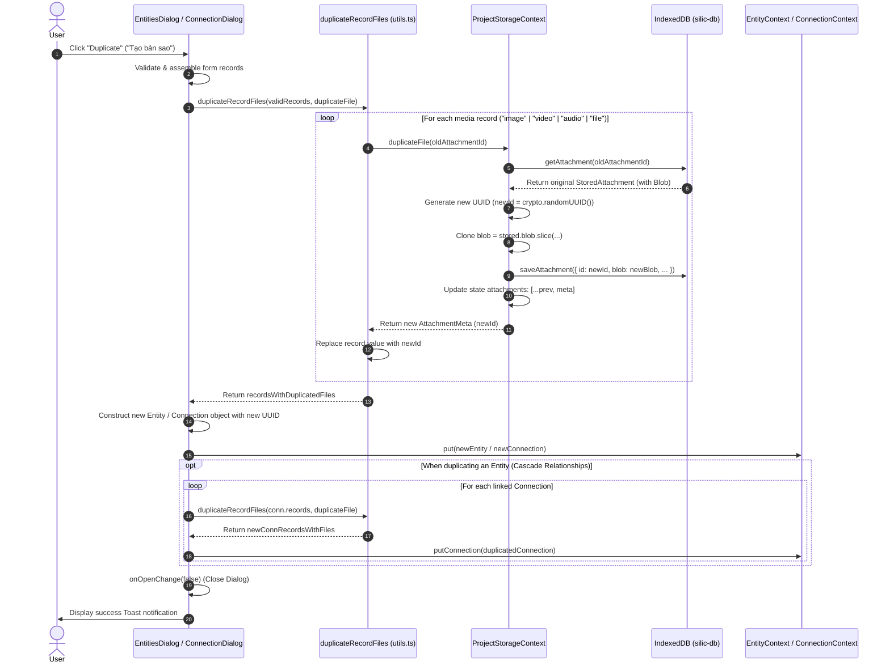
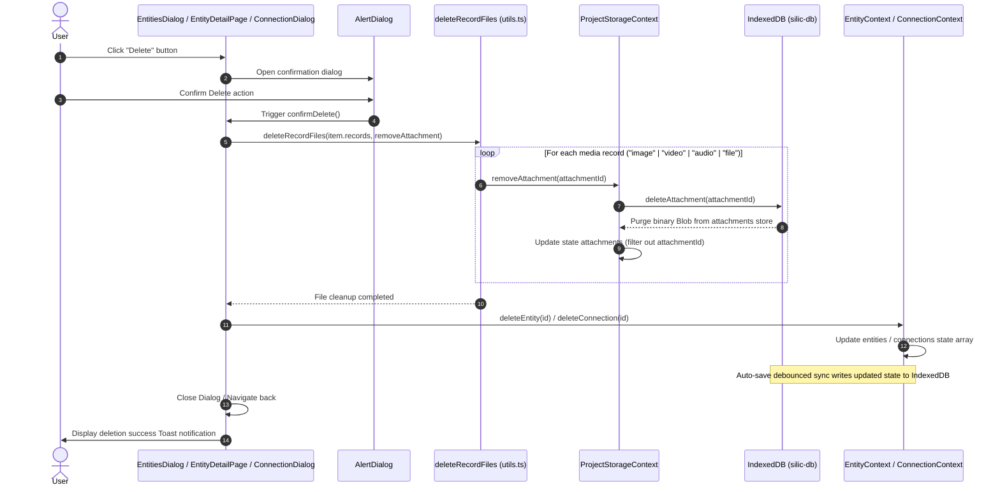
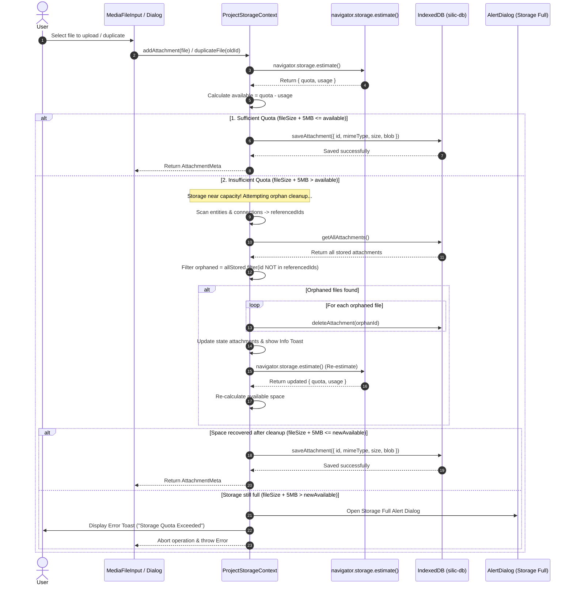
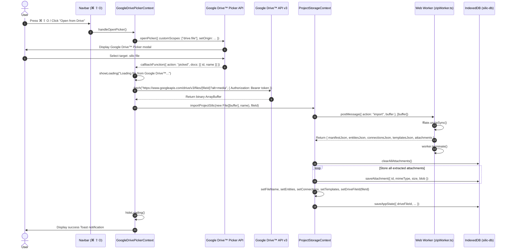
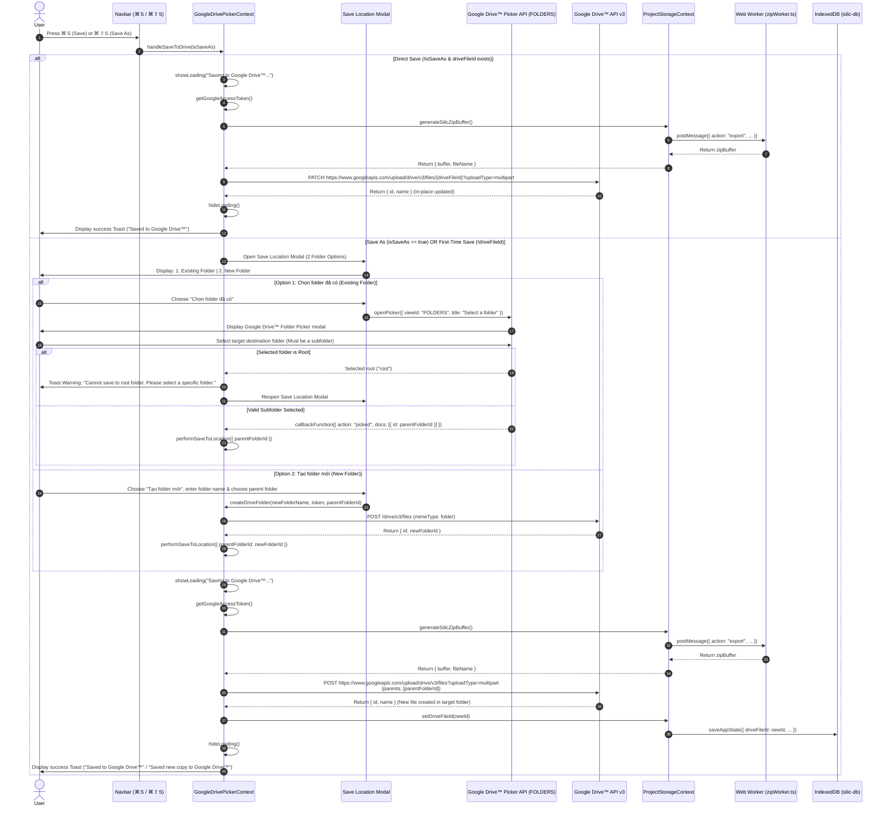
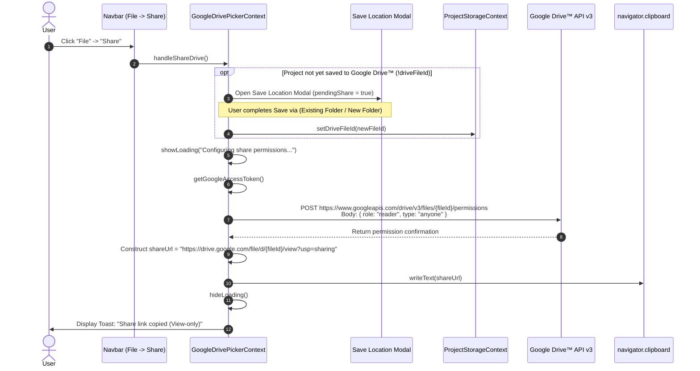

# Data Storage Architecture & Mechanism (Storage System)

This document details the architecture, component modules, data models, and storage processing workflow (**Storage Layer**) of the **Silic** project. The system is designed with a **Local-First & Offline-First** philosophy, combining local browser persistence via **IndexedDB** with compressed **`.silic` (ZIP bundle)** package archiving processed in a **Web Worker**.

---

## 1. Overview

Silic provides an entirely client-side storage ecosystem (Client-side Execution), ensuring 100% data privacy (Zero-tracking & Privacy-first). All entities, relationships, schema templates, and multimedia attachments (images, audio, video, binary files) are stored directly inside the user's browser.

```text
┌────────────────────────────────────────────────────────────────────────┐
│                              UI / View Layer                           │
│     (DiagramPage / EntityPage / ConnectionPage / TemplatesPage)        │
│     (EntitiesDialog / ConnectionDialog / TemplateDialog)               │
└───────────────────┬────────────────────────────────────┬───────────────┘
                    │                                    │
┌───────────────────▼────────────────────┐ ┌─────────────▼───────────────┐
│         Context & State Layer          │ │  LocalStorage Draft Layer   │
│ ├── Entity / Connection / TemplateCtx  │ │   (Temporary Form Drafts)   │
│ └── ProjectStorageContext (Auto-save)  │ │  ├── silic_draft_entity     │
└───────────────────┬────────────────────┘ │  ├── silic_draft_connection │
                    │                      │  └── silic_draft_template   │
┌───────────────────▼────────────────────┐ └─────────────────────────────┘
│        Processing & Worker Layer       │
│ ├── Web Worker (zipWorker.ts - fflate) │
│ ├── useMediaUrl Hook (Object URL)      │
│ └── File Helpers (upload / download)   │
└───────────────────┬────────────────────┘
                    │
┌───────────────────▼────────────────────┐
│        IndexedDB Storage Layer         │
│ ├── silic-db [app-state] (JSON state)  │
│ └── silic-db [attachments] (Blobs)     │
└───────────────────┬────────────────────┘
                    │
┌───────────────────▼────────────────────┐
│        External & Cloud Layer          │
│ ├── Local Project Archive .silic (ZIP) │
│ └── Google Drive™ Cloud Sync (REST v3)  │
└────────────────────────────────────────┘
```

### Structure of a `.silic` Package File:

A `.silic` file is an optimized standard ZIP archive containing root manifest and JSON data files alongside binary files stored in the `attachments/` folder (named and referenced purely by UUID):

```text
my-project.silic
├── manifest.json       # Version metadata, project name, export timestamp, attachment metadata list (ID, mimeType, size)
├── entities.json       # List of all entities (Entity[])
├── connections.json    # List of all relationships (Connection[])
├── templates.json      # List of schema templates (Template[])
└── attachments/        # Folder containing binary attachment files (identified by ID)
    ├── a1b2c3d4-e5f6-7890-abcd-ef1234567890
    ├── f6e5d4c3-b2a1-0987-dcba-0987654321fe
    └── 12345678-90ab-cdef-1234-567890abcdef
```

---

## 2. Contexts & Methods Used

### 2.1. `ProjectStorageContext` (`src/contexts/ProjectStorageContext.tsx`)

The central context managing current project state, automatic synchronization with IndexedDB, import/export coordination for `.silic` files, and attachment storage.

| Property / Method                       | Type / Signature                                                                          | Description                                                                                                    |
| :-------------------------------------- | :---------------------------------------------------------------------------------------- | :------------------------------------------------------------------------------------------------------------- |
| `fileName`                              | `string`                                                                                  | Current project name (displayed in title bar and used as export filename).                                     |
| `setFileName`                           | `(name: string) => void`                                                                  | Updates the project name.                                                                                      |
| `driveFileId`                           | `string \| null`                                                                          | Current Google Drive™ file ID associated with the workspace (null if local-only).                              |
| `setDriveFileId`                        | `(id: string \| null) => void`                                                            | Updates the active Google Drive™ file ID.                                                                      |
| `attachments`                           | `AttachmentMeta[]`                                                                        | List of metadata for all attachments in the project (`{ id, mimeType, size, caption }`).                       |
| `addAttachment`                         | `(file: File, customId?: string, caption?: string) => Promise<AttachmentMeta>`            | Saves file to IndexedDB, generates attachment metadata with default caption set to file name (or ID fallback). |
| `updateAttachmentCaption`               | `(id: string, caption: string) => Promise<void>`                                          | Updates the caption for an attachment in IndexedDB and React state.                                            |
| `removeAttachment`                      | `(id: string) => Promise<void>`                                                           | Deletes an attachment by ID from IndexedDB and updates the metadata list.                                      |
| `duplicateFile` / `duplicateAttachment` | `(oldId: string, customId?: string, caption?: string) => Promise<AttachmentMeta \| null>` | Clones an attachment's binary Blob in IndexedDB with a new UUID and registers duplicate metadata.              |
| `cleanupOrphanedAttachments`            | `() => Promise<number>`                                                                   | Scans and purges any binary files in IndexedDB not referenced by any entity or connection.                     |
| `exportProjectSilic`                    | `(customName?: string) => Promise<void>`                                                  | Packages all project state and attachments into a `.silic` file and downloads it.                              |
| `generateSilicZipBuffer`                | `(customName?: string) => Promise<{ buffer: ArrayBuffer; fileName: string }>`             | Packages the workspace into a `.silic` ZIP buffer for downloads or Google Drive™ uploads.                      |
| `importProjectSilic`                    | `(file: File, newDriveFileId?: string \| null) => Promise<void>`                          | Unpacks `.silic` file, reloads entities, connections, templates, and overwrites attachments in IndexedDB.      |
| `newProject`                            | `() => Promise<void>`                                                                     | Creates a new project, clearing all data and resetting state to a blank canvas.                                |
| `clearProject`                          | `() => Promise<void>`                                                                     | Wipes all data in IndexedDB (`app-state` & `attachments`), deletes form drafts, and resets state.              |
| `showLoading`                           | `(message?: string) => void`                                                              | Displays an interaction-blocking loading modal during heavy I/O operations.                                    |
| `hideLoading`                           | `() => void`                                                                              | Closes the loading modal.                                                                                      |
| `isLoading`                             | `boolean`                                                                                 | Open/close state of the loading dialog.                                                                        |

---

### 2.2. IndexedDB Database (`src/lib/db.ts`)

Powered by the `idb` library (Promise-based IndexedDB wrapper). The database is named **`silic-db`** (version `1`) and consists of 2 primary Object Stores:

1. **Store `app-state`** (`keyPath: "key"`):
   - Key: `"current-project"`
   - Value: `StoredAppState` containing `{ key, fileName, entities, connections, templates, attachments, driveFileId, updatedAt }`.
2. **Store `attachments`** (`keyPath: "id"`):
   - Key: `id` (UUID string).
   - Value: `StoredAttachment` containing `{ id, mimeType, size, blob, caption }`.

#### Database Operation Signatures:

```ts
// Attachments
saveAttachment(record: StoredAttachment): Promise<void>
getAttachment(id: string): Promise<StoredAttachment | undefined>
getAllAttachments(): Promise<StoredAttachment[]>
deleteAttachment(id: string): Promise<void>
clearAllAttachments(): Promise<void>

// App State
saveAppState(state: Omit<StoredAppState, "key">): Promise<void>
getAppState(): Promise<StoredAppState | undefined>
clearAppState(): Promise<void>
```

---

### 2.3. Hook `useMediaUrl` (`src/lib/hooks/useMediaUrl.ts`)

Hook for seamlessly resolving between external URLs and local internal attachment IDs:

- **External URL (`http://`, `https://`, `data:`, `blob:`)**: Returns the URL directly without querying IndexedDB.
- **Attachment ID (UUID)**: Fetches the Blob from IndexedDB via `getAttachment(id)`, initializes `URL.createObjectURL(blob)`, and automatically cleans up via `URL.revokeObjectURL(url)` on component unmount to prevent memory leaks.

---

### 2.4. Google Drive™ Cloud Context & Helpers (`GoogleDrivePickerContext.tsx` & `googleDrive.ts`)

Central coordinator for Google Drive™ cloud synchronization, picker file browsing, OAuth token caching, and permissions management:

| Property / Method   | Type / Signature                        | Description                                                                                                |
| :------------------ | :-------------------------------------- | :--------------------------------------------------------------------------------------------------------- |
| `handleOpenPicker`  | `(viewId?: ViewIdOptions, ...) => void` | Launches the Google Drive™ Picker dialog, downloads the selected `.silic` file binary, and imports it.     |
| `handleSaveToDrive` | `(isSaveAs?: boolean) => Promise<void>` | Serializes project state and performs a `PATCH` (update) or `POST` (create new) multipart upload to Drive. |
| `handleShareDrive`  | `() => Promise<void>`                   | Grants public view-only reader permission on Google Drive™ and copies the shareable URL to clipboard.      |
| `driveFileId`       | `string \| null`                        | Current Google Drive™ file ID.                                                                             |
| `isDriveLoading`    | `boolean`                               | Loading state indicating ongoing Google Drive™ network requests.                                           |

---

## 3. Attachment Upload Flow (Non-`.silic` Files)

This workflow applies when users add attachments (Images, Videos, Audio, Documents) to fields (`Record`) of an Entity or Relationship (`Connection`) through the `MediaFileInput` component.

> [!IMPORTANT]
> **ID-Only Identification Standard:**
> When a user uploads a file, the **original file name (`file.name`) is discarded entirely**. The system stores and identifies files strictly using `id` (random UUID), `mimeType`, `size`, and binary `blob` data. This guarantees anonymity, completely avoids file name collisions, and unifies storage formatting throughout the Silic ecosystem.

### Attachment Upload Sequence Diagram:



### Detailed Processing Steps:

1. **Hidden Input Initialization**: `uploadSingleFile()` creates a hidden `<input type="file" />` in the DOM, attaches `change` and `cancel` event listeners, and triggers `.click()`.
2. **Unique ID Generation & Filename Stripping**: Generates `id = crypto.randomUUID()` and strips away all original filenames.
3. **Binary Blob Storage**: Directly persists the `File` object into the `attachments` store of IndexedDB keyed by UUID.
4. **Linkage via Record ID**: The Record `value` property in Entity/Connection stores only this UUID string, keeping React state lean and decoupling large binary assets from the JSON tree.

---

## 4. `.silic` File Upload Flow (Import Project)

This workflow is triggered when a user selects **"Upload from device"** (or keyboard shortcut `⌘ U` / `Ctrl U`) to load a previously exported project archive.

### `.silic` Import Sequence Diagram:



### Detailed Processing Steps:

1. **Binary Buffer Read**: `file.arrayBuffer()` loads the entire `.silic` file into memory.
2. **Non-blocking Extraction (Web Worker)**: Spawns `zipWorker.ts` in a background thread, transferring the `ArrayBuffer` as a Transferable Object to keep the Main UI Thread responsive.
3. **Manifest & Data Parsing**:
   - `manifest.json`: Contains schema version (`version: 1`), original project name, export timestamp, and attachment metadata list.
   - `entities.json`, `connections.json`, `templates.json`: Restores the complete Knowledge Graph.
4. **Reconstruct Attachments in IndexedDB**: Reads sub-buffers from `attachments/*`, packs them into `Blob` instances with corresponding `mimeType`, and stores them in IndexedDB.
5. **Update Global State**: Propagates updated state to `EntityContext`, `ConnectionContext`, and `TemplateContext`.

---

## 5. `.silic` File Export Flow (Export Project)

This workflow is triggered when a user selects **"Download"** (or keyboard shortcut `⌘ D` / `Ctrl D`) to back up the current project locally.

### `.silic` Export Sequence Diagram:



### Optimal Compression Strategy in `zipWorker.ts`:

- **JSON Text Files (`manifest.json`, `entities.json`, `connections.json`, `templates.json`)**:
  Compressed using **DEFLATE Level 6** for maximum file size reduction (achieving 80–90% text compression).
- **Attachment Files (`attachments/*`)**:
  Packaged using **Level 0 (STORE - No compression)**. Since images (JPEG, PNG, WebP), video (MP4), and audio (MP3) formats are already compressed natively, re-compressing them via DEFLATE wastes CPU cycles with negligible file size gains. This strategy accelerates export operations significantly.

---

## 6. Other System Features

### 6.1. Realtime Debounced Auto-Save & On-Demand Data Loading

To prevent data loss if users close the browser or refresh the page while avoiding I/O saturation on IndexedDB:

- **Automatic Synchronization (Auto-Save)**: Any modification to `fileName`, `entities`, `connections`, `templates`, or `attachments` automatically syncs to the `app-state` store of `silic-db` after a 600ms debounce.
- **On-Demand Attachment Loading**: Attachments (`Blob`) reside separately in the `attachments` store. When a UI component needs to render media (e.g., cards, carousels, or lightboxes), the `useMediaUrl(id)` hook queries IndexedDB on demand and creates a temporary Object URL, keeping RAM usage low.
- **No Manual Save Required**: Because background saving is instantaneous and continuous, manual save buttons and `Ctrl S` shortcuts have been eliminated for a cleaner user experience.
- **Hydration Flag (`isHydrated`)**: Guarantees that auto-save is only activated after existing data has been loaded into React state on application boot, preventing empty array `[]` overrides over existing state.

```ts
React.useEffect(() => {
  if (!isHydrated) return

  const timer = setTimeout(async () => {
    try {
      await saveAppState({
        fileName,
        entities,
        connections,
        templates,
        attachments,
        updatedAt: new Date().toISOString(),
      })
    } catch (err) {
      console.error("Auto-save to IndexedDB failed:", err)
    }
  }, 600)

  return () => clearTimeout(timer)
}, [fileName, entities, connections, templates, attachments, isHydrated])
```

---

### 6.2. Global Keyboard Shortcuts

Standard keyboard shortcuts (using `⌘` on macOS or `Ctrl` on Windows/Linux) are listened to globally in `Navbar.tsx`:

| Shortcut                 | Action                            | Handler Function                              |
| :----------------------- | :-------------------------------- | :-------------------------------------------- |
| `⌘ N` / `Ctrl N`         | Create new project (Blank canvas) | `newProject()`                                |
| `⌘ ⇧ O` / `Ctrl Shift O` | Open project from Google Drive™   | `handleOpenPicker()`                          |
| `⌘ S` / `Ctrl S`         | Save project to Google Drive™     | `handleSaveToDrive(false)`                    |
| `⌘ ⇧ S` / `Ctrl Shift S` | Save as new copy to Google Drive™ | `handleSaveToDrive(true)`                     |
| `⌘ U` / `Ctrl U`         | Upload `.silic` project from disk | `uploadSingleFile()` → `importProjectSilic()` |
| `⌘ D` / `Ctrl D`         | Export and download `.silic` file | `exportProjectSilic()`                        |
| `⌘ Q` / `Ctrl Q`         | Open Entity Query Sheet           | `openEntityQuery()`                           |
| `⌘ ⇧ Q` / `Ctrl Shift Q` | Open Path Query Sheet             | `openPathQuery()`                             |
| `⌘ ⇧ K` / `Ctrl Shift K` | Open Analysis Page                | `openAnalysis()`                              |

---

### 6.3. Clear All Functionality & AlertDialog Confirmation

To allow users to completely reset their workspace or free local storage:

- **Navigation Menu Location**: `File` menu → `Clear` (Clear All).
- **Safety Confirmation (`AlertDialog`)**: To avoid accidental data loss, the system displays an `AlertDialog` (`src/components/ui/alert-dialog.tsx`) requiring user confirmation.
- **Execution Workflow (`clearProject`)**:
  1. Wipe all data in the `attachments` store of IndexedDB (`clearAllAttachments()`).
  2. Wipe all data in the `app-state` store of IndexedDB (`clearAppState()`).
  3. Clear temporary form drafts in `localStorage` (`silic_draft_*`).
  4. Reset all React states (`fileName: "Untitled"`, `entities: []`, `connections: []`, `templates: []`, `attachments: []`).
  5. Display success Toast notification.

---

### 6.4. MIME Types & Memory Management

- **Official MIME type for `.silic` files**: `application/vnd.silic+zip`.
- **Object URL Memory Release**: Every `URL.createObjectURL()` call (such as file downloads or media previews) is paired with a cleanup mechanism via `URL.revokeObjectURL()` to prevent memory leaks during extended sessions.

---

## 7. Dialog Draft Auto-Save Mechanism (Dialog Draft Storage)

For a seamless user experience (Seamless UX), Silic does not prompt disruptive "Discard Confirmation" dialogs when closing forms. Instead, all in-progress form inputs are **automatically persisted to local storage** and **restored automatically** upon reopening.

### 7.1. Storage Selection Strategy (LocalStorage vs. IndexedDB)

Silic adopts a **2-Tier Storage Strategy** optimized for **speed** and **performance**:

| Metric                  | LocalStorage (For Form Drafts)                                                    | IndexedDB (For Project Data)                                           |
| :---------------------- | :-------------------------------------------------------------------------------- | :--------------------------------------------------------------------- |
| **Purpose**             | Temporary Dialog drafts (`Entity`, `Connection`, `Template`)                      | Full Project data tree, App State & Binary Attachments (`Blob`)        |
| **Access Mechanism**    | **Synchronous** — Instant access (0ms latency)                                    | **Asynchronous** — Promise & Transaction based                         |
| **UI Initialization**   | **Zero-Flicker**: Read synchronously on component initialization (`initialState`) | Requires `useEffect` + `setState` post-mount, causing UI layout shifts |
| **Performance & Speed** | Ultra-lightweight for small payloads (< 50KB JSON), zero connection overhead      | Optimized for massive payloads (tens/hundreds of MB) and binary media  |
| **Cleanup**             | Instant `removeItem()` when user submits or resets                                | Requires transaction to delete store records                           |

> [!TIP]
> **Storage Decision Summary:**
>
> - **Form Drafts (Dialog Drafts)** → Uses **`localStorage`** for **zero latency (0ms)**, **peak performance**, and **zero-flicker UI initialization**.
> - **Project State & Attachments** → Uses **`IndexedDB`** for robust data persistence and large binary media handling.

---

### 7.2. Draft Storage Keys

Each dialog type utilizes an isolated identifier key in `localStorage`:

| Dialog               | LocalStorage Key         | Draft Data Structure                                                                                                       |
| :------------------- | :----------------------- | :------------------------------------------------------------------------------------------------------------------------- |
| **EntitiesDialog**   | `silic_draft_entity`     | `{ id?: string, template?: string, records?: RecordFormState[] }`                                                          |
| **ConnectionDialog** | `silic_draft_connection` | `{ id?: string, from?: string[], to?: string[], isDirectional?: boolean, template?: string, records?: RecordFormState[] }` |
| **TemplateDialog**   | `silic_draft_template`   | `{ id: string, name: string, records: TemplateRecord[] }`                                                                  |

---

### 7.3. Draft Lifecycle Flow



---

## 8. Item Duplication Flow & Binary File Cloning Mechanism

Silic provides a one-click **"Duplicate" ("Tạo bản sao")** action within `EntitiesDialog`, `ConnectionDialog`, and `TemplateDialog`. This creates an independent clone of the selected item without side-effects on original data.

### 8.1. Duplication Architecture Principles

1. **New Unique IDs**: The duplicate object and all its internal record definitions receive brand new UUIDs (`crypto.randomUUID()`).
2. **Deep Binary Media Cloning (`duplicateFile`)**:
   - For records of type `"image"`, `"video"`, `"audio"`, or `"file"`, referencing the same original attachment ID is avoided.
   - Instead, `duplicateFile` reads the original `Blob` from IndexedDB, creates an isolated binary slice (`stored.blob.slice()`), assigns a new UUID in the `attachments` store, and links the new ID to the duplicated record.
   - Both single media values and array/list values (`isArray: true`) are recursively duplicated via `duplicateRecordFiles()`.
3. **Relationship Cascading (Entity Duplication)**:
   - When an Entity is duplicated, all Relationships (`Connection`) involving the source entity (`from` or `to`) are automatically cloned.
   - The connection endpoints are remapped to point to the new Entity ID.
   - Any media attachments embedded inside the duplicated relationships are also independently cloned in storage.

### 8.2. Duplication Sequence Diagram



---

## 9. Entity & Connection Deletion Lifecycle & File Cleanup Mechanism

To maintain storage hygiene and prevent orphaned binary Blobs from lingering in IndexedDB, Silic implements an automated cascading cleanup pipeline whenever an Entity or Connection is removed.

### 9.1. Deletion Lifecycle Architecture

1. **Explicit User Confirmation**: Destructive delete actions require user confirmation via `AlertDialog` (`src/components/ui/alert-dialog.tsx`) to guard against unintended data loss.
2. **Cascading Media Attachment Deletion (`deleteRecordFiles`)**:
   - Before removing the metadata node from React state, `deleteRecordFiles` inspects all record fields.
   - For each `"image"`, `"video"`, `"audio"`, or `"file"` field (single or list values), it invokes `removeAttachment(fileId)`.
   - `removeAttachment` deletes the physical `Blob` record from IndexedDB (`silic-db` store `attachments`) and updates the `attachments` state array.
3. **Orphan Connection Purging**:
   - When modifying an entity's connections in `EntitiesDialog`, if all source and target endpoints are severed (`newFrom.length === 0 && newTo.length === 0`), the orphaned connection and all its associated media files are automatically removed.

### 9.2. Deletion Sequence Diagram



---

## 10. Storage Quota Pre-Estimation & Orphan Asset Garbage Collection Flow

To protect data integrity and prevent unpredictable browser write crashes, Silic integrates an automated **Storage Quota Pre-Estimation & Garbage Collection** pipeline before saving any new binary assets.

### 10.1. Quota Management Architecture Principles

1. **Proactive Pre-Estimation (`navigator.storage.estimate`)**:
   - Before executing `saveAttachment` for a new file upload or duplicate action, `checkStorageQuotaAndPrepare` queries `navigator.storage.estimate()`.
   - Computes available storage `available = quota - usage`.
   - Accounts for a **5MB Safety Buffer (`SAFETY_MARGIN`)** to ensure essential metadata and indexing transactions never fail.
2. **Automated Orphan Asset Detection (`getReferencedAttachmentIds`)**:
   - Gathers all attachment IDs referenced across all `entities` and `connections` in the project.
   - Compares this set against the total entries in IndexedDB's `attachments` store to identify unreferenced/orphaned files.
3. **Self-Healing Storage Cleanup (`cleanupOrphanedAttachments`)**:
   - If incoming file size exceeds remaining quota, the system automatically purges all orphaned attachments from IndexedDB.
   - Re-estimates storage quota post-cleanup.
4. **Storage Full Alert Modal (`AlertDialog`)**:
   - If quota is still insufficient after garbage collection, the file operation is aborted safely.
   - An `AlertDialog` popup (`t("projectStorage.quotaExceededTitle")`) notifies the user that browser storage is exhausted and advises exporting to a `.silic` file or removing unused media.

### 10.2. Quota Estimation & Cleanup Sequence Diagram



---

## 11. Google Drive™ Cloud Integration & Synchronization Flows

Silic offers seamless cloud synchronization with Google Drive™ without requiring any custom backend infrastructure (100% Client-Side Architecture). All interactions utilize official Google Identity Services (GIS) OAuth 2.0 with the secure `https://www.googleapis.com/auth/drive.file` scopes.

### 11.1. Architecture & Privacy Principles

1. **Least Privilege Scope (`drive.file`)**: The app only requests access to files that were opened via the Google Drive™ Picker or created by Silic itself. It cannot read or modify any other files on the user's Google Drive™.
2. **Zero-Backend Architecture**: OAuth token acquisition, multipart file uploads, binary downloads, and permission management execute entirely inside the user's browser.
3. **Drive File Identity Binding (`driveFileId`)**: When a project is opened from or saved to Google Drive™, its unique Google Drive™ `fileId` is bound to the workspace state and persisted in IndexedDB `app-state`.
4. **Active Trash Status Detection (`trashed` & `explicitlyTrashed`)**:
   - Google Drive™ API v3 resource `files` contains boolean flags: `trashed` (file is in trash, either directly or cascaded from parent folder) and `explicitlyTrashed` (file was directly trashed).
   - Silic always verifies `fields=id,name,mimeType,trashed,explicitlyTrashed` prior to downloading (`files.get?alt=media`) or updating (`files.update`).
   - If a file is detected as trashed, Silic immediately **unlinks the Google Drive™ identity (`driveFileId = null`)**, halts download or falls back to folder selection, and notifies the user with a clear warning Toast.

---

### 11.2. Flow 1: Open from Google Drive™ (Picker API)

This flow is triggered when the user clicks **"Open from Drive"** (`⌘ ⇧ O` / `Ctrl Shift O`).



#### Detailed Processing Steps:

1. **Picker Invocation**: Google Drive™ Picker is displayed with the user's authenticated Google Account.
2. **Media Stream Download**: Fetches binary bytes via `https://www.googleapis.com/drive/v3/files/${fileId}?alt=media`.
3. **Web Worker Unpack**: The downloaded `ArrayBuffer` is passed to `zipWorker.ts` to extract JSON datasets and binary attachments without blocking the main UI thread.
4. **State & Database Sync**: Restores the knowledge graph, saves attachments to IndexedDB, binds the `driveFileId`, and updates the UI.

---

### 11.3. Flow 2: Save & Save As to Google Drive™ (Multipart Upload & Folder-Only Location Policy)

- **Root Directory Save Prohibition**:
  To maintain a clean Google Drive™ storage hierarchy and avoid loose files in the root folder, saving `.silic` project files directly into the root directory (`"root"` / `My Drive`) is strictly prohibited. Both the backend API layer (`ROOT_SAVE_DISALLOWED`) and client UI validation enforce that all project files must reside within a designated folder.

- **Save (`⌘ S` / `Ctrl S`)**:
  - **With `driveFileId` (Already linked to Drive)**: Directly executes an HTTP `PATCH` multipart upload request to update the existing file in-place (`https://www.googleapis.com/upload/drive/v3/files/${driveFileId}?uploadType=multipart`) without opening any dialog.
  - **Without `driveFileId` (Local-only document)**: Displays a Save Location Modal providing 2 folder-based options:
    1. **Chọn folder đã có (Existing Folder)**: Opens the Google Drive™ Picker (`viewId: "FOLDERS"`, title: `"Select a folder"`). If the user attempts to select root My Drive, the system rejects root selection, prompts a warning Toast, and asks for a subfolder.
    2. **Tạo folder mới (New Folder)**: Prompts the user for a new folder name and optional parent folder (defaults to My Drive), creates the folder on Google Drive™ via `POST https://www.googleapis.com/drive/v3/files` (`mimeType: application/vnd.google-apps.folder`), and uploads the `.silic` archive inside this newly created folder.
- **Save As (`⌘ ⇧ S` / `Ctrl Shift S`)**:
  - Regardless of current `driveFileId`, opens the Save Location Modal with the same 2 folder options, exports the current project, uploads as a new file in the selected folder on Google Drive™, and updates `driveFileId`.



---

### 11.4. Flow 3: View-Only File Sharing (Permissions API)

This flow allows users to instantly share their project for view-only access without manual email permission management.

> [!NOTE]
> **Auto-Save Flow Redirection**: If a user clicks **Share** when the document has not yet been saved to Google Drive™ (`!driveFileId`), the application automatically redirects to the **Save Location flow** (displaying the folder selection/creation options). Once saved in a designated folder, it immediately creates the view-only permission and copies the share link to the clipboard.



#### Key Sharing Features:

- **Zero Configuration**: Automatically sets `role: "reader"` and `type: "anyone"`, making the file accessible to anyone with the link.
- **Auto-Upload Fallback**: If the user clicks Share on a local-only document, Silic automatically prompts to save it into a folder on Drive before creating the share link.
- **Clipboard Integration**: Automatically copies the URL directly to the user's clipboard.

---

### 11.5. Flow 4: Google Drive™ "Open/Create with Silic" Integration (App Startup State Parameter)

When a user right-clicks a `.silic` file on Google Drive™ and selects **"Open with Silic"** or creates a new file via **"New > More > Silic"**, Google Drive™ launches the application URL (`/d`) with a serialized `state` query parameter:

```json
{
  "action": "open" | "create",
  "ids": ["0B..."],
  "resourceKeys": { "0B...": "rk_val" },
  "folderId": "0B_folder...",
  "folderResourceKey": "folder_rk_val",
  "userId": "1029384756..."
}
```

```mermaid
sequenceDiagram
    autonumber
    actor User as Google Drive™ User
    participant Browser as Browser Window
    participant DriveCtx as GoogleDrivePickerContext
    participant AuthModal as Sign-in Prompt Dialog
    participant GIS as Google Identity Services (GIS)
    participant DriveAPI as Google Drive™ API v3
    participant StorageCtx as ProjectStorageContext
    participant Worker as Web Worker (zipWorker.ts)
    participant IDB as IndexedDB (silic-db)

    User->>Browser: Click "Open with Silic" or "New > Silic" in Drive Web UI
    Browser->>Browser: Navigate to https://silic.kemlib.com/d?state={...}
    Browser->>DriveCtx: GoogleDrivePickerProvider mounts

    Note over DriveCtx,Browser: Step 1: Idempotency Guard & Safe State Parsing
    DriveCtx->>DriveCtx: Check Idempotency Guard (processedDriveStates Set)
    alt Already Processed (React StrictMode double mount / HMR reload)
        DriveCtx-->>DriveCtx: Skip duplicate execution (Prevent infinite loop / stale reload)
    else First Execution
        DriveCtx->>DriveCtx: Multi-stage JSON parse (direct JSON & decodeURIComponent)
        alt State Missing or Malformed (JSON Parse Exception)
            DriveCtx->>User: Toast Error: "Invalid Google Drive™ startup parameters."
            DriveCtx->>DriveCtx: Terminate startup flow cleanly (No lingering spinner)
        else Valid State Parsed
            DriveCtx->>DriveCtx: Mark state as processed in Idempotency Guard
            DriveCtx->>Browser: Synchronize RouterContext & Strip `state` (navigate /d, replace)
            DriveCtx->>DriveCtx: showLoading("Opening / Creating with Google Drive™...")

            Note over DriveCtx,AuthModal: Step 2: Resilient Silent OAuth with Timeout Wrapper
            DriveCtx->>DriveCtx: withTimeout(getGoogleAccessToken({ prompt: "", hint: userId }), 5000)
            alt Silent OAuth Fails OR Times Out (AdBlock / 3P Cookie Blocked / User Hint Mismatch)
                DriveCtx->>DriveCtx: hideLoading() (Pause spinner)
                DriveCtx->>AuthModal: Display "Sign in with Google" Prompt Dialog (with userId hint)
                User->>AuthModal: Click "Sign in with Google" (Authentic User Click Gesture)
                AuthModal->>DriveCtx: showLoading("Authenticating with Google...")
                AuthModal->>GIS: withTimeout(getGoogleAccessToken({ prompt: "consent", hint: userId }), 60000)
                GIS-->>DriveCtx: Return OAuth 2.0 Access Token
            else Silent OAuth Succeeds within 5s
                GIS-->>DriveCtx: Return Cached / Silent Access Token
            end

            Note over DriveCtx,IDB: Step 3: Action Execution with Catch-All Error Handling
            alt action === "open"
                DriveCtx->>DriveAPI: GET /files/{fileId}?fields=id,name,mimeType,trashed,explicitlyTrashed<br/>(Header: X-Goog-Drive-Resource-Keys, withTimeout: 15s)
                alt 401 Unauthorized (Token Revoked / Expired in Transit)
                    DriveAPI-->>DriveCtx: 401 Unauthorized
                    DriveCtx->>User: Toast Error: "Google authorization expired. Please sign in again."
                else 403 Forbidden (Permission Denied / Missing Resource Key)
                    DriveAPI-->>DriveCtx: 403 Forbidden
                    DriveCtx->>User: Toast Error: "Access Denied. Switch Google account or verify link-sharing key."
                else 404 Not Found (Permanently Deleted / Invalid File ID)
                    DriveAPI-->>DriveCtx: 404 Not Found
                    DriveCtx->>User: Toast Error: "File not found on Google Drive™."
                else 429 Too Many Requests (Rate Limit Exceeded)
                    DriveAPI-->>DriveCtx: 429 Rate Limit
                    DriveCtx->>User: Toast Error: "Google Drive™ rate limit reached. Please try again later."
                else 500/503 Server Error / Network TypeError (Failed to fetch)
                    DriveAPI-->>DriveCtx: 500/503 / Network Error
                    DriveCtx->>User: Toast Error: "Network or Google Drive™ server error. Please check connection."
                else File is in Trash (trashed === true)
                    DriveAPI-->>DriveCtx: Metadata { trashed: true }
                    DriveCtx->>User: Toast Error: "File has been moved to trash on Google Drive™."
                else File Active (200 OK)
                    DriveAPI-->>DriveCtx: Metadata { name: "project.silic", trashed: false }
                    DriveCtx->>DriveAPI: GET /files/{fileId}?alt=media (Header: X-Goog-Drive-Resource-Keys, withTimeout: 30s)
                    DriveAPI-->>DriveCtx: Return binary ArrayBuffer
                    DriveCtx->>StorageCtx: importProjectSilic(new File([buffer]), fileId)
                    
                    Note over StorageCtx,Worker: Step 4: Web Worker Unpack with onerror & 15s Timeout
                    StorageCtx->>Worker: postMessage({ action: "import", buffer })
                    alt Worker Load Error / Crash / Memory Kill / Corrupt Archive
                        Worker-->>StorageCtx: worker.onerror OR withTimeout(15s) Rejection
                        StorageCtx->>User: Toast Error: "Failed to extract .silic file or archive corrupted."
                    else Successful Decompression
                        Worker-->>StorageCtx: Extracted datasets & attachments
                        StorageCtx->>IDB: Save attachments & App State (QuotaExceededError handled)
                        StorageCtx->>StorageCtx: setDriveFileId(fileId)
                        DriveCtx->>Browser: navigate("/d")
                        DriveCtx->>User: Toast Success: "Opened file from Google Drive™"
                    end
                end
            else action === "create"
                DriveCtx->>StorageCtx: newProject() (Reset workspace to blank canvas)
                alt folderId is a specific subfolder (folderId !== "root")
                    DriveCtx->>DriveCtx: createEmptySilicBuffer("Untitled")
                    DriveCtx->>DriveAPI: POST /files?uploadType=multipart (parents: [folderId], Header: X-Goog-Drive-Resource-Keys, withTimeout: 45s)
                    alt Create File Error (401/403/404/429/500/Network)
                        DriveAPI-->>DriveCtx: Error response
                        DriveCtx->>User: Toast Error: "Failed to create file on Google Drive™."
                    else Create File Success (200 OK)
                        DriveAPI-->>DriveCtx: Return created file { id: "newFile123" }
                        DriveCtx->>StorageCtx: setDriveFileId("newFile123")
                        DriveCtx->>Browser: navigate("/d")
                        DriveCtx->>User: Toast Success: "Created new file on Google Drive™"
                    end
                else folderId is root or unspecified
                    Note over DriveCtx,Browser: Avoid creating loose files in root. Initialize canvas in memory.
                    DriveCtx->>Browser: navigate("/d")
                    DriveCtx->>User: Toast Info: "New project ready. Save to a folder when completed."
                end
            end
        end
    end

    Note over DriveCtx,User: Step 5: Guaranteed Teardown (Finally Block)
    DriveCtx->>DriveCtx: finally { hideLoading(); setIsDriveLoading(false); }
```

---

#### Detailed Failure Modes, Risk Analysis & Defensive Engineering Guidelines

To prevent **infinite loading spinners**, **silent promise stalls**, and **race-condition crashes** during Google Drive™ app startup integration, Silic enforces strict defensive programming guidelines across 5 core failure domains:

---

##### Category A: State Parsing & URL Lifecycle Risks

1. **Uncaught `JSON.parse` Exceptions (Malformed / Truncated State)**:
   - **Failure Vector**: The `state` parameter may exceed proxy/browser URL length limits, be double-encoded (`%257B...`), or contain unescaped special characters in `resourceKeys`. Calling `JSON.parse()` without resilient multi-stage decoding causes runtime exceptions. If a loading state was set prior to parsing, the UI locks in an infinite spinner without displaying error messages.
   - **Defensive Strategy**:
     - Implement a two-stage parsing fallback: try direct `JSON.parse(stateStr)`, then fallback to `JSON.parse(decodeURIComponent(stateStr))`.
     - Enclose extraction logic in dedicated `try/catch` blocks.
     - On parse failure, immediately log the raw string with `console.error()`, show a descriptive error toast (`"Tham số khởi động Google Drive™ không hợp lệ"` / `"Invalid Google Drive™ startup parameters."`), and ensure the loading state is deactivated.

2. **`history.replaceState` Race Conditions & React StrictMode Double-Mount**:
   - **Failure Vector**: In React 18 (Strict Mode in development) or during fast route transitions/HMR, the root `useEffect` executes twice. The first run parses the `state` parameter and calls `history.replaceState` to strip it from the URL. The second run detects an empty or `undefined` state. If the effect does not guard against duplicate or empty states, it may re-trigger a loading spinner that never terminates.
   - **Defensive Strategy**:
     - **Idempotency Guard**: Store processed raw state signatures in a module-level set (`processedDriveStates`) or `sessionStorage`.
     - Check `if (!rawState) return` and skip processing immediately without setting loading flags.
     - Ensure URL sanitization happens strictly after successful state extraction.

3. **Router State Desynchronization**:
   - **Failure Vector**: Using raw `window.history.replaceState` alone can desynchronize browser history from internal router state (such as `RouterContext`'s internal location tracker), leading to unexpected re-renders with stale query parameters.
   - **Defensive Strategy**: Synchronize URL cleanup directly through router navigation primitives (e.g., `navigate(targetPath + newSearch, { replace: true })`), keeping both browser history and in-memory routing state consistent.

---

##### Category B: Silent OAuth & Pop-up Blocker Risks

4. **Silent OAuth Hanging Indefinitely (`getGoogleAccessToken`)**:
   - **Failure Vector**: Silent token acquisition (`prompt: ""`, with `hint: userId`) uses an invisible iframe and Google Identity Services (GIS) `postMessage` callbacks. The promise will **never resolve or reject** if:
     - The GIS client script (`https://accounts.google.com/gsi/client`) is blocked by AdBlock, tracking blockers, or strict CSP policies.
     - Third-party cookies are blocked by browser privacy mechanisms (Safari ITP, Brave Shields, Chrome Privacy Sandbox 3P cookie deprecation).
     - The provided `hint: userId` does not match the active session in the user's browser.
   - **Defensive Strategy**:
     - Wrap all silent token acquisition calls with a strict timeout utility (`withTimeout(promise, 5000, "Silent OAuth timeout")`).
     - When the timeout triggers, reject the silent flow immediately, dismiss the spinner, and display the **Sign-in Prompt Dialog** (`AlertDialog` / `AuthModal`).

5. **Silent Pop-up Blocking on Unprompted Mounts**:
   - **Failure Vector**: Calling interactive OAuth (`prompt: "consent"`) programmatically upon component mount without a direct user gesture causes modern browsers to silently block the popup window (returning `null` or suppressing the window). As a result, GIS callbacks never fire, hanging all subsequent `await` calls.
   - **Defensive Strategy**:
     - Never launch interactive OAuth popups automatically on mount.
     - When silent OAuth fails or times out, display the **Sign-in Prompt Dialog**. The user clicking `"Đăng nhập Google"` constitutes an authentic user gesture that browsers permit.

---

##### Category C: Google Drive™ API v3 & Catch-All Error Handling

6. **Comprehensive HTTP Status Code & Network Error Handling**:
   - **Failure Vector**: Handling only specific error statuses (such as 403 or 404) while omitting others causes unhandled HTTP responses (401, 429, 500, 503) or pure network exceptions (`TypeError: Failed to fetch` caused by offline state, DNS failures, or CORS rejections) to bypass standard branches. Uncaught network errors leave the UI in an eternal loading state.
   - **Defensive Strategy**:
     - Implement an explicit error handling matrix:
       | Status / Error | Diagnostic Reason | Handled User Action |
       | :--- | :--- | :--- |
       | **401 Unauthorized** | Token expired or revoked during transit | Clear cached token, prompt user to re-authenticate |
       | **403 Forbidden** | User lacks file permissions or missing resource key | Display Toast advising switching to the owner Google account |
       | **404 Not Found** | File was deleted permanently or invalid file ID | Display Toast: `"File not found on Google Drive™"` |
       | **429 Too Many Requests** | Google API rate limit or quota exceeded | Display Toast: `"Rate limit reached. Please try again in a moment."` |
       | **500 / 503 Server Error** | Google Drive™ backend temporarily unavailable | Display Toast: `"Google Drive™ server error. Please retry shortly."` |
       | **Network Error / Fetch Failure** | Offline, DNS resolution error, or CORS blocked | Display Toast: `"Network connection error. Please verify your internet connection."` |
       | **File in Trash (`trashed: true`)** | File resides in Google Drive™ Trash | Display Toast: `"File is in trash. Restore it on Drive before opening."` |
       | **Catch-All Generic Fallback** | Unforeseen runtime exception | Display Toast: `"An error occurred. Please try again."` |

7. **Link-Sharing Security Updates & Resource Key Verification**:
   - **Failure Vector**: Files shared via link generated after Google's 2021 Drive security update require the `X-Goog-Drive-Resource-Keys` request header. If the header is missing, Google returns `403 Forbidden`, which can be misdiagnosed as account permission refusal.
   - **Defensive Strategy**: Extract `resourceKeys[fileId]` or `folderResourceKey` from the `state` parameter and automatically append `X-Goog-Drive-Resource-Keys: ${id}/${key}` to all Drive API fetch headers.

8. **Scope `drive.file` Per-File Grant Boundary & Intentional 404 Response**:
   - **Architectural Context**: Silic intentionally requests the narrow, privacy-friendly `https://www.googleapis.com/auth/drive.file` scope. This scope grants access *only* to files created by Silic or files explicitly selected by the user via Google Picker / Drive UI.
   - **404 vs 403 Security Behavior**: When an application makes an API call for a file ID without prior per-file authorization under `drive.file`, Google Drive API intentionally responds with `404 Not Found` (rather than `403 Forbidden`) as a security defense-in-depth measure to avoid leaking file existence to unauthorized apps.
   - **Implication for Manual URL Testing**: Synthetic test URLs manually crafted with arbitrary file IDs will receive `404 Not Found` unless the file was legitimately created by Silic or selected through the real Google Drive UI "Open with" action (which automatically grants the per-file token permission).

9. **Guaranteed Cleanup via `finally` Block**:
   - **Failure Vector**: Scattershot loading resets inside intermediate `try` branches often miss unhandled exception branches.
   - **Defensive Strategy**: Always place `hideLoading()` and `setIsDriveLoading(false)` inside a global `finally` block enclosing the entire startup execution flow.

---

##### Category D: Web Worker & Storage Persistence Risks

9. **Web Worker Silent Failure & Crash Protection**:
   - **Failure Vector**: The main thread delegates `.silic` archive decompression to `zipWorker.ts` via `postMessage({ action: "import", buffer })`. If the worker script fails to load (wrong path post-build, CSP `worker-src` restriction), throws an unhandled runtime error without `onerror`, or is killed by the browser due to memory constraints on massive files, `postMessage` never returns, hanging the application indefinitely.
   - **Defensive Strategy**:
     - Attach a dedicated `worker.onerror` listener alongside `worker.onmessage`.
     - Wrap the worker promise with a 15-second timeout (`setTimeout`).
     - In the event of a worker error or timeout, terminate the worker instance (`worker.terminate()`), reject the import promise, and display an explicit corruption notification.

10. **IndexedDB Quota & Private Browsing Constraints**:
    - **Failure Vector**: In Safari Private Browsing mode or when disk storage quota is exceeded, IndexedDB transactions reject with `QuotaExceededError` or `SecurityError`.
    - **Defensive Strategy**: Wrap all IndexedDB persistence calls in `try/catch` and provide a clear fallback warning toast (`"Storage quota exceeded or private browsing restriction. Please free space."`).

---

##### Category E: Robustness Patterns & Debugging Utilities

Below are standard patterns implemented to prevent hanging promises and guarantee UI stability:

```typescript
// 1. Generic Timeout Wrapper for Asynchronous Callbacks
export function withTimeout<T>(
  promise: Promise<T>,
  ms: number,
  errorMessage = "Operation timed out"
): Promise<T> {
  return Promise.race([
    promise,
    new Promise<T>((_, reject) =>
      setTimeout(() => reject(new Error(errorMessage)), ms)
    ),
  ])
}

// 2. Idempotency Guard Pattern for Startup Effects
const processedDriveStates = new Set<string>()

export function isStateAlreadyHandled(rawState: string): boolean {
  if (!rawState) return true
  if (processedDriveStates.has(rawState)) return true
  processedDriveStates.add(rawState)
  return false
}

// 3. Web Worker Execution Wrapper with Timeout and Error Trap
export function extractArchiveWithWorker(
  fileBuffer: ArrayBuffer,
  timeoutMs = 15000
): Promise<ExtractedArchiveData> {
  return new Promise((resolve, reject) => {
    let isSettled = false
    const worker = new Worker(
      new URL("../lib/workers/zipWorker.ts", import.meta.url),
      { type: "module" }
    )

    const timer = setTimeout(() => {
      if (!isSettled) {
        isSettled = true
        worker.terminate()
        reject(new Error("Worker timed out during archive decompression (15s limit)"))
      }
    }, timeoutMs)

    worker.onmessage = (e: MessageEvent) => {
      if (isSettled) return
      isSettled = true
      clearTimeout(timer)
      const res = e.data
      worker.terminate()
      if (res.success && res.action === "import") {
        resolve(res)
      } else {
        reject(new Error(res.error || "Import failed"))
      }
    }

    worker.onerror = (err: ErrorEvent) => {
      if (isSettled) return
      isSettled = true
      clearTimeout(timer)
      worker.terminate()
      reject(new Error(`Worker execution error: ${err.message || "Failed to decompress archive"}`))
    }

    worker.postMessage({ action: "import", buffer: fileBuffer }, [fileBuffer])
  })
}
```

