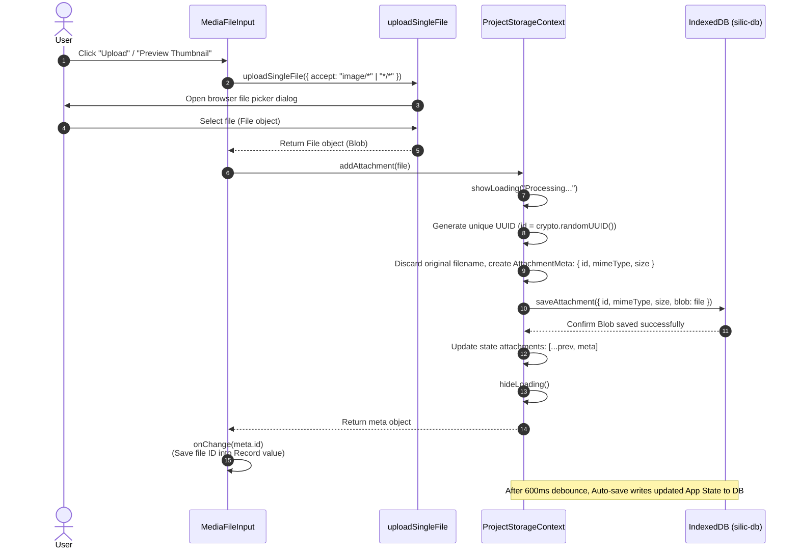
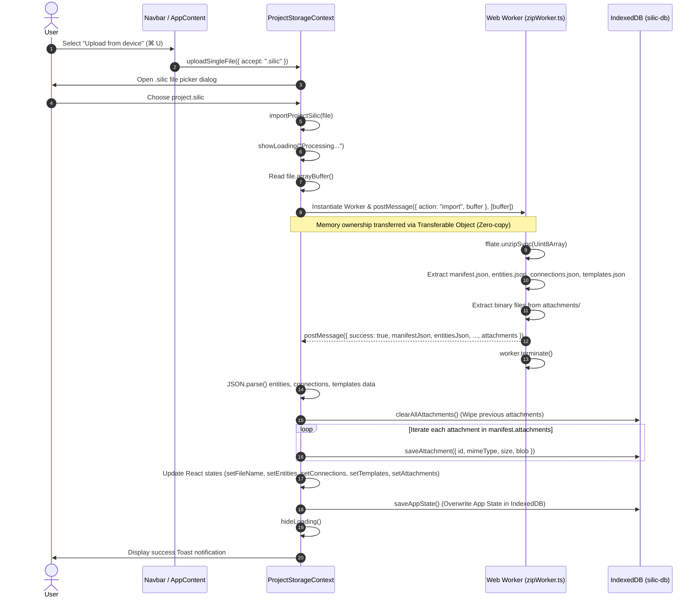
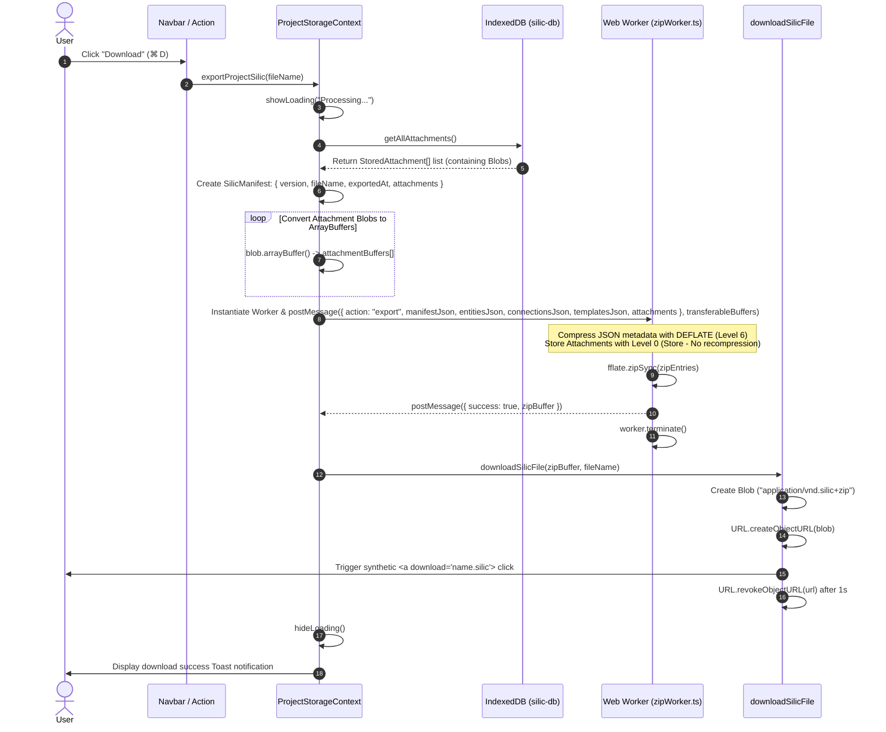
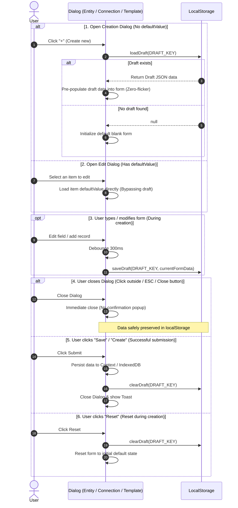
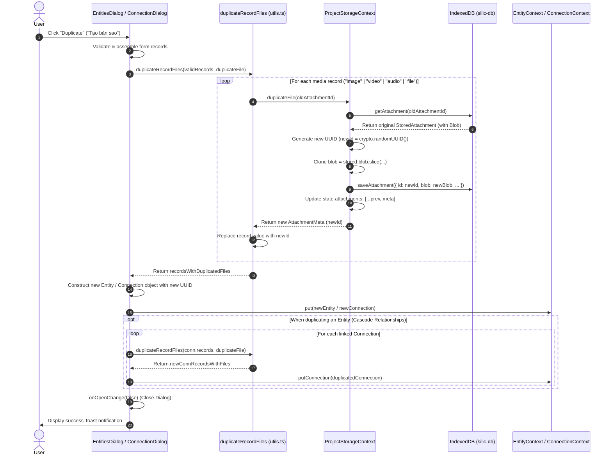
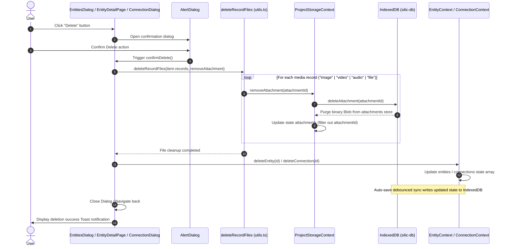
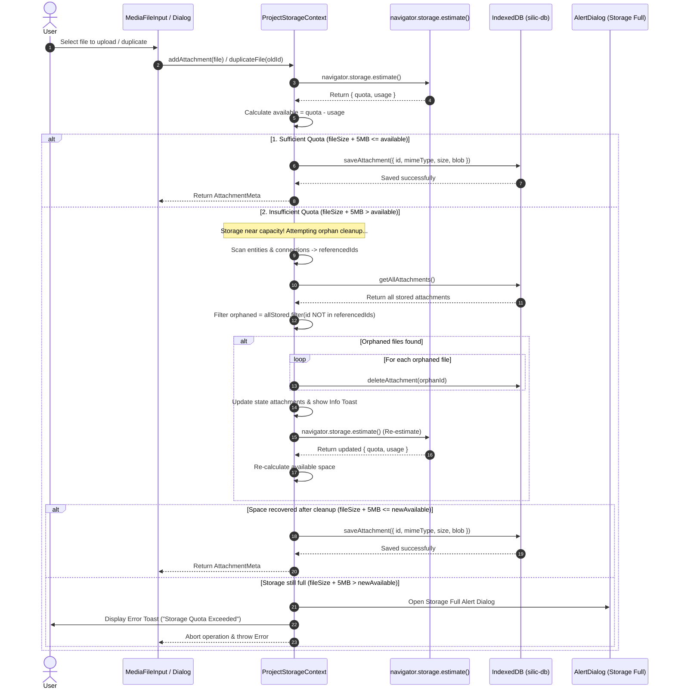

# Data Storage Architecture & Mechanism (Storage System)

This document details the architecture, component modules, data models, and storage processing workflow (**Storage Layer**) of the **Silic** project. The system is designed with a **Local-First & Offline-First** philosophy, combining local browser persistence via **IndexedDB** with compressed **`.silic` (ZIP bundle)** package archiving processed in a **Web Worker**.

---

## 1. Overview

Silic provides an entirely client-side storage ecosystem (Client-side Execution), ensuring 100% data privacy (Zero-tracking & Privacy-first). All entities, relationships, schema templates, and multimedia attachments (images, audio, video, binary files) are stored directly inside the user's browser.

```text
┌────────────────────────────────────────────────────────────────────────┐
│                              UI / View Layer                           │
│     (DiagramPage / EntityPage / ConnectionPage / TemplatesPage)        │
│     (EntitiesDialog / ConnectionDialog / TemplateDialog)               │
└───────────────────┬────────────────────────────────────┬───────────────┘
                    │                                    │
┌───────────────────▼────────────────────┐ ┌─────────────▼───────────────┐
│         Context & State Layer          │ │  LocalStorage Draft Layer   │
│ ├── Entity / Connection / TemplateCtx  │ │   (Temporary Form Drafts)   │
│ └── ProjectStorageContext (Auto-save)  │ │  ├── silic_draft_entity     │
└───────────────────┬────────────────────┘ │  ├── silic_draft_connection │
                    │                      │  └── silic_draft_template   │
┌───────────────────▼────────────────────┐ └─────────────────────────────┘
│        Processing & Worker Layer       │
│ ├── Web Worker (zipWorker.ts - fflate) │
│ ├── useMediaUrl Hook (Object URL)      │
│ └── File Helpers (upload / download)   │
└───────────────────┬────────────────────┘
                    │
┌───────────────────▼────────────────────┐
│        IndexedDB Storage Layer         │
│ ├── silic-db [app-state] (JSON state)  │
│ └── silic-db [attachments] (Blobs)     │
└───────────────────┬────────────────────┘
                    │
┌───────────────────▼────────────────────┐
│        External / Export Layer         │
│ └── Project Archive .silic (ZIP)       │
└────────────────────────────────────────┘
```

### Structure of a `.silic` Package File:

A `.silic` file is an optimized standard ZIP archive containing root manifest and JSON data files alongside binary files stored in the `attachments/` folder (named and referenced purely by UUID):

```text
my-project.silic
├── manifest.json       # Version metadata, project name, export timestamp, attachment metadata list (ID, mimeType, size)
├── entities.json       # List of all entities (Entity[])
├── connections.json    # List of all relationships (Connection[])
├── templates.json      # List of schema templates (Template[])
└── attachments/        # Folder containing binary attachment files (identified by ID)
    ├── a1b2c3d4-e5f6-7890-abcd-ef1234567890
    ├── f6e5d4c3-b2a1-0987-dcba-0987654321fe
    └── 12345678-90ab-cdef-1234-567890abcdef
```

---

## 2. Contexts & Methods Used

### 2.1. `ProjectStorageContext` (`src/contexts/ProjectStorageContext.tsx`)

The central context managing current project state, automatic synchronization with IndexedDB, import/export coordination for `.silic` files, and attachment storage.

| Property / Method | Type / Signature | Description |
| :----------------------- | :---------------------------------------- | :----------------------------------------------------------------------------------------------------------- |
| `fileName`               | `string`                                  | Current project name (displayed in title bar and used as export filename).                                  |
| `setFileName`            | `(name: string) => void`                  | Updates the project name.                                                                                    |
| `attachments`            | `AttachmentMeta[]`                        | List of metadata for all attachments in the project (`{ id, mimeType, size, caption }`).                    |
| `addAttachment`          | `(file: File, customId?: string, caption?: string) => Promise<AttachmentMeta>` | Saves file to IndexedDB, generates attachment metadata with default caption set to file name (or ID fallback). |
| `updateAttachmentCaption`| `(id: string, caption: string) => Promise<void>` | Updates the caption for an attachment in IndexedDB and React state.                                         |
| `removeAttachment`       | `(id: string) => Promise<void>`           | Deletes an attachment by ID from IndexedDB and updates the metadata list.                                    |
| `duplicateFile` / `duplicateAttachment` | `(oldId: string, customId?: string, caption?: string) => Promise<AttachmentMeta \| null>` | Clones an attachment's binary Blob in IndexedDB with a new UUID and registers duplicate metadata.            |
| `cleanupOrphanedAttachments` | `() => Promise<number>`                   | Scans and purges any binary files in IndexedDB not referenced by any entity or connection.                    |
| `exportProjectSilic`     | `(customName?: string) => Promise<void>`  | Packages all project state and attachments into a `.silic` file and downloads it.                            |
| `importProjectSilic`     | `(file: File) => Promise<void>`           | Unpacks `.silic` file, reloads entities, connections, templates, and overwrites attachments in IndexedDB.    |
| `newProject`             | `() => Promise<void>`                     | Creates a new project, clearing all data and resetting state to a blank canvas.                              |
| `clearProject`           | `() => Promise<void>`                     | Wipes all data in IndexedDB (`app-state` & `attachments`), deletes form drafts, and resets state.            |
| `showLoading`            | `(message?: string) => void`              | Displays an interaction-blocking loading modal during heavy I/O operations.                                  |
| `hideLoading`            | `() => void`                              | Closes the loading modal.                                                                                    |
| `isLoading`              | `boolean`                                 | Open/close state of the loading dialog.                                                                      |

---

### 2.2. IndexedDB Database (`src/lib/db.ts`)

Powered by the `idb` library (Promise-based IndexedDB wrapper). The database is named **`silic-db`** (version `1`) and consists of 2 primary Object Stores:

1. **Store `app-state`** (`keyPath: "key"`):
   - Key: `"current-project"`
   - Value: `StoredAppState` containing `{ key, fileName, entities, connections, templates, attachments, updatedAt }`.
2. **Store `attachments`** (`keyPath: "id"`):
   - Key: `id` (UUID string).
   - Value: `StoredAttachment` containing `{ id, mimeType, size, blob, caption }`.

#### Database Operation Signatures:

```ts
// Attachments
saveAttachment(record: StoredAttachment): Promise<void>
getAttachment(id: string): Promise<StoredAttachment | undefined>
getAllAttachments(): Promise<StoredAttachment[]>
deleteAttachment(id: string): Promise<void>
clearAllAttachments(): Promise<void>

// App State
saveAppState(state: Omit<StoredAppState, "key">): Promise<void>
getAppState(): Promise<StoredAppState | undefined>
clearAppState(): Promise<void>
```

---

### 2.3. Hook `useMediaUrl` (`src/lib/hooks/useMediaUrl.ts`)

Hook for seamlessly resolving between external URLs and local internal attachment IDs:

- **External URL (`http://`, `https://`, `data:`, `blob:`)**: Returns the URL directly without querying IndexedDB.
- **Attachment ID (UUID)**: Fetches the Blob from IndexedDB via `getAttachment(id)`, initializes `URL.createObjectURL(blob)`, and automatically cleans up via `URL.revokeObjectURL(url)` on component unmount to prevent memory leaks.

---

## 3. Attachment Upload Flow (Non-`.silic` Files)

This workflow applies when users add attachments (Images, Videos, Audio, Documents) to fields (`Record`) of an Entity or Relationship (`Connection`) through the `MediaFileInput` component.

> [!IMPORTANT]
> **ID-Only Identification Standard:**
> When a user uploads a file, the **original file name (`file.name`) is discarded entirely**. The system stores and identifies files strictly using `id` (random UUID), `mimeType`, `size`, and binary `blob` data. This guarantees anonymity, completely avoids file name collisions, and unifies storage formatting throughout the Silic ecosystem.

### Attachment Upload Sequence Diagram:



### Detailed Processing Steps:

1. **Hidden Input Initialization**: `uploadSingleFile()` creates a hidden `<input type="file" />` in the DOM, attaches `change` and `cancel` event listeners, and triggers `.click()`.
2. **Unique ID Generation & Filename Stripping**: Generates `id = crypto.randomUUID()` and strips away all original filenames.
3. **Binary Blob Storage**: Directly persists the `File` object into the `attachments` store of IndexedDB keyed by UUID.
4. **Linkage via Record ID**: The Record `value` property in Entity/Connection stores only this UUID string, keeping React state lean and decoupling large binary assets from the JSON tree.

---

## 4. `.silic` File Upload Flow (Import Project)

This workflow is triggered when a user selects **"Upload from device"** (or keyboard shortcut `⌘ U` / `Ctrl U`) to load a previously exported project archive.

### `.silic` Import Sequence Diagram:



### Detailed Processing Steps:

1. **Binary Buffer Read**: `file.arrayBuffer()` loads the entire `.silic` file into memory.
2. **Non-blocking Extraction (Web Worker)**: Spawns `zipWorker.ts` in a background thread, transferring the `ArrayBuffer` as a Transferable Object to keep the Main UI Thread responsive.
3. **Manifest & Data Parsing**:
   - `manifest.json`: Contains schema version (`version: 1`), original project name, export timestamp, and attachment metadata list.
   - `entities.json`, `connections.json`, `templates.json`: Restores the complete Knowledge Graph.
4. **Reconstruct Attachments in IndexedDB**: Reads sub-buffers from `attachments/*`, packs them into `Blob` instances with corresponding `mimeType`, and stores them in IndexedDB.
5. **Update Global State**: Propagates updated state to `EntityContext`, `ConnectionContext`, and `TemplateContext`.

---

## 5. `.silic` File Export Flow (Export Project)

This workflow is triggered when a user selects **"Download"** (or keyboard shortcut `⌘ D` / `Ctrl D`) to back up the current project locally.

### `.silic` Export Sequence Diagram:



### Optimal Compression Strategy in `zipWorker.ts`:

- **JSON Text Files (`manifest.json`, `entities.json`, `connections.json`, `templates.json`)**:
  Compressed using **DEFLATE Level 6** for maximum file size reduction (achieving 80–90% text compression).
- **Attachment Files (`attachments/*`)**:
  Packaged using **Level 0 (STORE - No compression)**. Since images (JPEG, PNG, WebP), video (MP4), and audio (MP3) formats are already compressed natively, re-compressing them via DEFLATE wastes CPU cycles with negligible file size gains. This strategy accelerates export operations significantly.

---

## 6. Other System Features

### 6.1. Realtime Debounced Auto-Save & On-Demand Data Loading

To prevent data loss if users close the browser or refresh the page while avoiding I/O saturation on IndexedDB:

- **Automatic Synchronization (Auto-Save)**: Any modification to `fileName`, `entities`, `connections`, `templates`, or `attachments` automatically syncs to the `app-state` store of `silic-db` after a 600ms debounce.
- **On-Demand Attachment Loading**: Attachments (`Blob`) reside separately in the `attachments` store. When a UI component needs to render media (e.g., cards, carousels, or lightboxes), the `useMediaUrl(id)` hook queries IndexedDB on demand and creates a temporary Object URL, keeping RAM usage low.
- **No Manual Save Required**: Because background saving is instantaneous and continuous, manual save buttons and `Ctrl S` shortcuts have been eliminated for a cleaner user experience.
- **Hydration Flag (`isHydrated`)**: Guarantees that auto-save is only activated after existing data has been loaded into React state on application boot, preventing empty array `[]` overrides over existing state.

```ts
React.useEffect(() => {
  if (!isHydrated) return

  const timer = setTimeout(async () => {
    try {
      await saveAppState({
        fileName,
        entities,
        connections,
        templates,
        attachments,
        updatedAt: new Date().toISOString(),
      })
    } catch (err) {
      console.error("Auto-save to IndexedDB failed:", err)
    }
  }, 600)

  return () => clearTimeout(timer)
}, [fileName, entities, connections, templates, attachments, isHydrated])
```

---

### 6.2. Global Keyboard Shortcuts

Standard keyboard shortcuts (using `⌘` on macOS or `Ctrl` on Windows/Linux) are listened to globally in `Navbar.tsx`:

| Shortcut | Action | Handler Function |
| :--------------- | :--------------------------------- | :-------------------------------------------------------- |
| `⌘ N` / `Ctrl N` | Create new project (Blank canvas) | `newProject()` |
| `⌘ U` / `Ctrl U` | Upload `.silic` project from disk | `uploadSingleFile()` → `importProjectSilic()` |
| `⌘ D` / `Ctrl D` | Export and download `.silic` file | `exportProjectSilic()` |

---

### 6.3. Clear All Functionality & AlertDialog Confirmation

To allow users to completely reset their workspace or free local storage:

- **Navigation Menu Location**: `File` menu → `Clear` (Clear All).
- **Safety Confirmation (`AlertDialog`)**: To avoid accidental data loss, the system displays an `AlertDialog` (`src/components/ui/alert-dialog.tsx`) requiring user confirmation.
- **Execution Workflow (`clearProject`)**:
  1. Wipe all data in the `attachments` store of IndexedDB (`clearAllAttachments()`).
  2. Wipe all data in the `app-state` store of IndexedDB (`clearAppState()`).
  3. Clear temporary form drafts in `localStorage` (`silic_draft_*`).
  4. Reset all React states (`fileName: "Untitled"`, `entities: []`, `connections: []`, `templates: []`, `attachments: []`).
  5. Display success Toast notification.

---

### 6.4. MIME Types & Memory Management

- **Official MIME type for `.silic` files**: `application/vnd.silic+zip`.
- **Object URL Memory Release**: Every `URL.createObjectURL()` call (such as file downloads or media previews) is paired with a cleanup mechanism via `URL.revokeObjectURL()` to prevent memory leaks during extended sessions.

---

## 7. Dialog Draft Auto-Save Mechanism (Dialog Draft Storage)

For a seamless user experience (Seamless UX), Silic does not prompt disruptive "Discard Confirmation" dialogs when closing forms. Instead, all in-progress form inputs are **automatically persisted to local storage** and **restored automatically** upon reopening.

### 7.1. Storage Selection Strategy (LocalStorage vs. IndexedDB)

Silic adopts a **2-Tier Storage Strategy** optimized for **speed** and **performance**:

| Metric | LocalStorage (For Form Drafts) | IndexedDB (For Project Data) |
| :--- | :--- | :--- |
| **Purpose** | Temporary Dialog drafts (`Entity`, `Connection`, `Template`) | Full Project data tree, App State & Binary Attachments (`Blob`) |
| **Access Mechanism** | **Synchronous** — Instant access (0ms latency) | **Asynchronous** — Promise & Transaction based |
| **UI Initialization** | **Zero-Flicker**: Read synchronously on component initialization (`initialState`) | Requires `useEffect` + `setState` post-mount, causing UI layout shifts |
| **Performance & Speed** | Ultra-lightweight for small payloads (< 50KB JSON), zero connection overhead | Optimized for massive payloads (tens/hundreds of MB) and binary media |
| **Cleanup** | Instant `removeItem()` when user submits or resets | Requires transaction to delete store records |

> [!TIP]
> **Storage Decision Summary:**
> - **Form Drafts (Dialog Drafts)** → Uses **`localStorage`** for **zero latency (0ms)**, **peak performance**, and **zero-flicker UI initialization**.
> - **Project State & Attachments** → Uses **`IndexedDB`** for robust data persistence and large binary media handling.

---

### 7.2. Draft Storage Keys

Each dialog type utilizes an isolated identifier key in `localStorage`:

| Dialog | LocalStorage Key | Draft Data Structure |
| :--- | :--- | :--- |
| **EntitiesDialog** | `silic_draft_entity` | `{ id?: string, template?: string, records?: RecordFormState[] }` |
| **ConnectionDialog** | `silic_draft_connection` | `{ id?: string, from?: string[], to?: string[], isDirectional?: boolean, template?: string, records?: RecordFormState[] }` |
| **TemplateDialog** | `silic_draft_template` | `{ id: string, name: string, records: TemplateRecord[] }` |

---

### 7.3. Draft Lifecycle Flow



---

## 8. Item Duplication Flow & Binary File Cloning Mechanism

Silic provides a one-click **"Duplicate" ("Tạo bản sao")** action within `EntitiesDialog`, `ConnectionDialog`, and `TemplateDialog`. This creates an independent clone of the selected item without side-effects on original data.

### 8.1. Duplication Architecture Principles

1. **New Unique IDs**: The duplicate object and all its internal record definitions receive brand new UUIDs (`crypto.randomUUID()`).
2. **Deep Binary Media Cloning (`duplicateFile`)**:
   - For records of type `"image"`, `"video"`, `"audio"`, or `"file"`, referencing the same original attachment ID is avoided.
   - Instead, `duplicateFile` reads the original `Blob` from IndexedDB, creates an isolated binary slice (`stored.blob.slice()`), assigns a new UUID in the `attachments` store, and links the new ID to the duplicated record.
   - Both single media values and array/list values (`isArray: true`) are recursively duplicated via `duplicateRecordFiles()`.
3. **Relationship Cascading (Entity Duplication)**:
   - When an Entity is duplicated, all Relationships (`Connection`) involving the source entity (`from` or `to`) are automatically cloned.
   - The connection endpoints are remapped to point to the new Entity ID.
   - Any media attachments embedded inside the duplicated relationships are also independently cloned in storage.

### 8.2. Duplication Sequence Diagram



---

## 9. Entity & Connection Deletion Lifecycle & File Cleanup Mechanism

To maintain storage hygiene and prevent orphaned binary Blobs from lingering in IndexedDB, Silic implements an automated cascading cleanup pipeline whenever an Entity or Connection is removed.

### 9.1. Deletion Lifecycle Architecture

1. **Explicit User Confirmation**: Destructive delete actions require user confirmation via `AlertDialog` (`src/components/ui/alert-dialog.tsx`) to guard against unintended data loss.
2. **Cascading Media Attachment Deletion (`deleteRecordFiles`)**:
   - Before removing the metadata node from React state, `deleteRecordFiles` inspects all record fields.
   - For each `"image"`, `"video"`, `"audio"`, or `"file"` field (single or list values), it invokes `removeAttachment(fileId)`.
   - `removeAttachment` deletes the physical `Blob` record from IndexedDB (`silic-db` store `attachments`) and updates the `attachments` state array.
3. **Orphan Connection Purging**:
   - When modifying an entity's connections in `EntitiesDialog`, if all source and target endpoints are severed (`newFrom.length === 0 && newTo.length === 0`), the orphaned connection and all its associated media files are automatically removed.

### 9.2. Deletion Sequence Diagram



---

## 10. Storage Quota Pre-Estimation & Orphan Asset Garbage Collection Flow

To protect data integrity and prevent unpredictable browser write crashes, Silic integrates an automated **Storage Quota Pre-Estimation & Garbage Collection** pipeline before saving any new binary assets.

### 10.1. Quota Management Architecture Principles

1. **Proactive Pre-Estimation (`navigator.storage.estimate`)**:
   - Before executing `saveAttachment` for a new file upload or duplicate action, `checkStorageQuotaAndPrepare` queries `navigator.storage.estimate()`.
   - Computes available storage `available = quota - usage`.
   - Accounts for a **5MB Safety Buffer (`SAFETY_MARGIN`)** to ensure essential metadata and indexing transactions never fail.
2. **Automated Orphan Asset Detection (`getReferencedAttachmentIds`)**:
   - Gathers all attachment IDs referenced across all `entities` and `connections` in the project.
   - Compares this set against the total entries in IndexedDB's `attachments` store to identify unreferenced/orphaned files.
3. **Self-Healing Storage Cleanup (`cleanupOrphanedAttachments`)**:
   - If incoming file size exceeds remaining quota, the system automatically purges all orphaned attachments from IndexedDB.
   - Re-estimates storage quota post-cleanup.
4. **Storage Full Alert Modal (`AlertDialog`)**:
   - If quota is still insufficient after garbage collection, the file operation is aborted safely.
   - An `AlertDialog` popup (`t("projectStorage.quotaExceededTitle")`) notifies the user that browser storage is exhausted and advises exporting to a `.silic` file or removing unused media.

### 10.2. Quota Estimation & Cleanup Sequence Diagram




